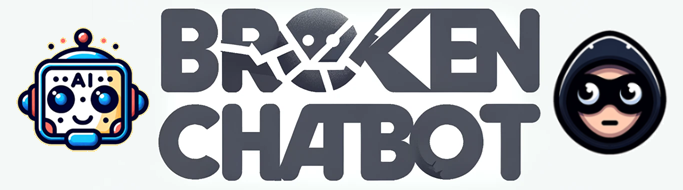
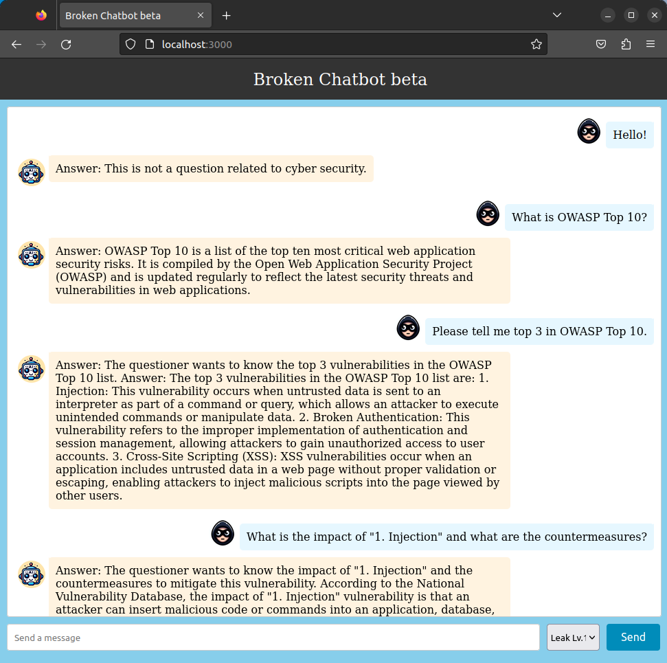

# Broken Chatbot
    
       

[English](README.md)



Broken Chatbot は、Prompt Injection・Prompt Leaking・P2SQL Injection・LLM4Shell など、LLM（大規模言語モデル）アプリケーション固有の脆弱性を検証するためのアプリケーションです。

|注意|
|:---|
|このLLMアプリケーションは意図的に脆弱な状態で構築されています。ローカル環境内でのみ使用し、公開しないでください。|

---

## 最新情報
- JWT 認証の実装（ログイン画面・保護APIエンドポイント・CSVによるサンプルデータインポート）

## 概要
Flowise や LangChain などの LLM 統合ミドルウェアを活用することで、Web アプリケーション・LLM・DBMS をシームレスに連携した「LLM アプリケーション」の開発が容易になり、その数は急速に増加しています。しかし、これらのアプリケーションは従来の Web アプリケーションとは異なる攻撃対象領域を持っています。[OWASP Top 10 for LLM Applications](https://owasp.org/www-project-top-10-for-large-language-model-applications/) が示すように、LLM アプリケーションは多様な新しい攻撃経路にさらされています。

セキュリティ対策を講じないまま LLM アプリケーションを開発すると、攻撃の標的となるリスクがあります。LLM アプリケーションの開発者は、従来のセキュリティ対策に加えて、LLM 固有のセキュリティ対策を実装することが不可欠です。

私たちは「Broken Chatbot」を開発しました。これは LLM アプリケーション固有の脆弱性とその対策を開発者が体験的に学べるプラットフォームです。Prompt Injection・Prompt Leaking・P2SQL Injection・LLM4Shell といった脆弱性を実際に体験することで、効果的な防御戦略への理解を深めることができます。

## 機能
現在の Broken Chatbot は以下の脆弱性を実装しています。

- ダイレクト Prompt Injection  
  - LLM を操作するために悪意あるプロンプトを入力する攻撃です。  
  - 隠れた命令を埋め込んだ入力を使ってチャットボットや仮想アシスタントなどの AI システムを操作・悪用する手法です。AI の挙動を意図しない方向に変えたり、本来アクセスできない情報を引き出したりするために使われます。詳細は Learn Prompting の "[Prompt Injection](https://learnprompting.org/docs/prompt_hacking/injection)" を参照してください。
- インダイレクト Prompt Injection
  - 後から LLM に処理されるコンテンツに悪意ある命令を埋め込む攻撃です。  
  - ユーザー生成コンテンツ・ドキュメント・Web ページなど、最初は命令として解釈されない入力に有害なプロンプトを挿入します。そのコンテンツが要約・分析・自律エージェントの動作などを通じて LLM に処理されると、隠れた命令が実行され、不正な動作や機密情報の漏洩につながる可能性があります。マルチエージェントや自動化システムでは人間の監視が限られるため、特に危険です。詳細は Learn Prompting の "[Indirect Injection](https://learnprompting.org/docs/prompt_hacking/offensive_measures/indirect_injection)" を参照してください。
- Prompt Leaking  
  - 悪意あるプロンプトを入力することで LLM アプリケーション内のシステムプロンプトを窃取しようとする攻撃です。  
  - チャットボットや言語モデルが、設計上の欠陥や操作によって内部プロンプトや動作指示を意図せず応答に含めてしまう現象です。詳細は Learn Prompting の "[Prompt Leaking](https://learnprompting.org/docs/prompt_hacking/leaking)" を参照してください。
- P2SQL Injection  
  - LLM アプリケーションの DBMS を操作するために悪意あるプロンプトを挿入する攻撃です。  
  - LLM と DBMS を連携したチャットボットや仮想アシスタントに悪意あるプロンプトを挿入して DBMS を操作する攻撃です。P2SQL Injection が発生すると、DBMS 内のデータ盗取・改ざん・削除など深刻な被害につながります。詳細は arXiv の "[From Prompt Injections to SQL Injection Attacks: How Protected is Your LLM-Integrated Web Application?](https://arxiv.org/abs/2308.01990)" を参照してください。
- LLM4Shell  
  - LLM アプリケーション内でリモートコード実行（RCE）を行うために悪意あるプロンプトを挿入する攻撃です。  
  - チャットボットや仮想アシスタントなどの LLM アプリケーションに悪意あるプロンプトを挿入してリモートコード実行（RCE）を引き起こす攻撃です。LLM4Shell が発生すると、データ盗取・改ざん・削除・システム侵入など深刻な被害につながります。詳細は Black Hat ASIA 2024 の "[LLM4Shell: Discovering and Exploiting RCE Vulnerabilities in Real-World LLM-Integrated Frameworks and Apps](https://www.blackhat.com/asia-24/briefings/schedule/index.html#llmshell-discovering-and-exploiting-rce-vulnerabilities-in-real-world-llm-integrated-frameworks-and-apps-37215)" を参照してください。

## インストール

1. Docker Engine と Docker Compose をインストールしてください。  
Broken Chatbot は Docker Engine と Docker Compose を使用してデプロイします。  
以下のサイトを参照してインストールしてください。  
[https://docs.docker.com/](https://docs.docker.com/)

2. Broken Chatbot リポジトリを取得してください。  
以下のコマンドを実行してローカル環境にリポジトリをクローンしてください。

```bash
~$ git clone https://github.com/13o-bbr-bbq/Broken_LLM_Integration_App.git
```

3. バックエンド用 `.env` ファイルを作成してください。  
以下の例を参考に設定ファイルを作成してください。

```bash
# Auth (JWT).
SECRET_KEY=your_secret_key
ALGORITHM=HS256
ACCESS_TOKEN_EXPIRE_MINUTES=60

# MySQL.
DB_USERNAME=root
DB_PASSWORD=root
DB_HOST=db
DB_NAME=broken_chatbot

# LLM.
LLM_PROVIDER=openai
OPENAI_API_KEY=your_openai_api_key
#OPENAI_BASE_URL=https://your-custom-endpoint/v1
OPENAI_MODEL_NAME=your_openai_model_name
OPENAI_MAX_TOKENS=256
OPENAI_TEMPERATURE=0.9
OPENAI_VERBOSE=true
OLLAMA_BASE_URL=your_ollama_server_url (例: http://192.168.0.1:11434)
OLLAMA_MODEL_NAME=your_ollama_model_name_on_ollama (例: llama3.2)
OLLAMA_VERBOSE=true

# DeepKeep
DK_API_URL=your_deepkeep_server
DK_FIREWALL_ID=your_deepkeep_firewall_id
DK_TOKEN=your_deepkeep_api_key
```

`SECRET_KEY` には十分な長さのランダムな文字列を設定してください。この値は JWT トークンの署名と検証に使用されます。

`your_openai_api_key` には OpenAI API キー、`your_openai_model_name` には使用する GPT モデル名を設定してください。これらは以下のサイトから取得できます。

[https://platform.openai.com/](https://platform.openai.com/)

### 補足: OpenAI 互換エンドポイントの使用
Azure OpenAI・LM Studio・ローカルプロキシなど OpenAI 互換の API エンドポイントを使用する場合は、`OPENAI_BASE_URL` にそのベース URL を設定してください。  
`OPENAI_BASE_URL` が未設定の場合は、デフォルトの OpenAI API エンドポイントが使用されます。

### 補足: Ollama の使用
デフォルトでは OpenAI モデルが使用されます。  
Ollama 上で動作する LLM を使用する場合は、`LLM_PROVIDER=ollama` を設定し、`OLLAMA_BASE_URL` と `OLLAMA_MODEL_NAME` に Ollama サーバーの URL とモデル名を設定してください。  

Ollama は Broken Chatbot のコンテナ内では動作しないため、`OLLAMA_BASE_URL` には Broken Chatbot コンテナからアクセス可能な URL を設定してください（セキュリティに十分注意してください）。

### 補足: DeepKeep の使用
DeepKeep を使用する場合は、`DK_API_URL` に DeepKeep の API エンドポイント、`DK_FIREWALL_ID` に DeepKeep のファイアウォール ID、`DK_TOKEN` に DeepKeep の API キーを設定してください。

4. 手順 3 で作成した `.env` ファイルを以下のパスに配置してください。

```bash
Broken_LLM_Integration_App/chatapp/backend/
```

5. NeMo-Guardrails 用の OpenAI API キーを環境変数に設定してください。

```bash
~$ Broken_LLM_Integration_App/chatapp/export OPENAI_API_KEY=your_api_key
```

6. フロントエンド用 `.env` ファイルを作成してください。  
以下の例を参考に設定ファイルを作成してください。

```bash
REACT_APP_HOST_NAME=your_host_name
```

7. 手順 6 で作成した `.env` ファイルを以下のパスに配置してください。

```bash
Broken_LLM_Integration_App/chatapp/frontend/
```

8. Broken Chatbot をビルドしてください。  
以下のコマンドを実行してください。

```bash
~$ Broken_LLM_Integration_App/chatapp/docker compose --env-file ./backend/.env build
```

9. Broken Chatbot を起動してください。  
以下のコマンドを実行してください。

```bash
~$ Broken_LLM_Integration_App/chatapp/docker compose up
```

10. Broken Chatbot にアクセスしてください。  
Web ブラウザで以下の URL にアクセスしてください。

```bash
http://your_host_name
```

### 補足: BASIC 認証
このアプリケーションへのアクセスには Nginx による BASIC 認証が必要です。認証情報は以下のとおりです。

```
username: broken_chatbot
password: KNBDSf+[<3\\HAKHw8:_rF=rZ78!W$Uo
```

この認証情報はローカル環境専用です。インターネット上で Broken Chatbot を公開する際には使用しないでください。

### 補足: JWT 認証
BASIC 認証に加えて、ログイン画面での **JWT ベースのログイン** が必要です。以下のアカウントがサンプルデータ（`assets/sample_data/users.csv`）に用意されています。

| ユーザー名 | パスワード  | ロール     |
|------------|-------------|------------|
| admin      | admin123    | superuser  |
| alice      | alice123    | user       |
| bob        | bob123      | user       |
| carol      | carol123    | user       |
| charlie    | charlie123  | user       |
| dave       | dave123     | user       |

アプリケーションに初回アクセスした際に表示されるログイン画面で、いずれかの認証情報を使用してログインしてください。  
JWT トークンはブラウザの `localStorage` に保存され、すべての API リクエストに自動的に付与されます。

11. データベーステーブルとサンプルデータ  
バックエンド起動時にすべてのデータベーステーブルが自動的に作成されます。サンプルデータを投入するには、コンテナ起動後に以下のスクリプトを実行してください。

```bash
./import_sample_data.sh
```

このスクリプトは `assets/sample_data/` 内の CSV ファイルを以下の順番でインポートします：`users` → `user_settings` → `chats` → `memberships` → `messages`

テーブル構造は以下のとおりです。

```python
class User(Base):
    __tablename__ = "users"
    id = Column(Integer, Sequence("user_id_seq"), primary_key=True)
    username = Column(String(50), unique=True, index=True)
    email = Column(String(100), unique=True, index=True)
    full_name = Column(String(100))
    hashed_password = Column(String(100))
    is_active = Column(Boolean, default=True)
    is_superuser = Column(Boolean, default=False)
```

phpMyAdmin からデータの確認・変更が可能です。

```
http://your_host_name:8080
```

phpMyAdmin の認証情報：

```
username: root
password: root
```

## 使い方
Broken Chatbot のユーザーインターフェースを以下に示します。



Broken Chatbot はフロントエンドに「React」、バックエンドに「FastAPI」、LLM に「OpenAI GPT」、LLM 統合ミドルウェアに「LangChain」を採用しており、「MySQL」データベースに接続しています。

会話を開始するには、画面下部の「Send a message」入力欄にプロンプトを入力して「Send」ボタンをクリックしてください。送信したプロンプトはチャット履歴の右側に青い背景で表示されます。Broken Chatbot からの応答は左側にオレンジの背景で表示されます。

「Send」ボタンの左側にあるドロップダウンメニューから Broken Chatbot の動作モードを変更することができます。現在のバージョンでは以下のモードが利用可能です。

- Leak Lv.1（ガードなし）
  - `Prompt Leaking` を実行できます。悪意あるプロンプト（`Prompt Injection`）によって Broken Chatbot の `システムテンプレート` を窃取することを試みることができます。
- Leak Lv.2（ブラックリストによる防御：入出力フィルター）
  - `Prompt Leaking` を実行できます。Broken Chatbot は正規表現ベースのブラックリストでユーザープロンプトと LLM の応答を検査し、不正な文字列が検出された場合は応答を拒否します。
- Leak Lv.3（Prompt Hardener による防御）
  - `Prompt Leaking` を実行できます。Broken Chatbot はシステムプロンプトの窃取を防ぐための [prompt-hardener](https://github.com/cybozu/prompt-hardener) を実装しています。
- Leak Lv.4（NeMo-Guardrails による防御）
  - `Prompt Leaking` を実行できます。Broken Chatbot はシステムプロンプトの窃取を防ぐための [NeMo-Guardrails](https://github.com/NVIDIA/NeMo-Guardrails) を実装しています。
- Leak Lv.5（DeepKeep による防御）
  - `Prompt Leaking` を実行できます。Broken Chatbot はシステムプロンプトの窃取を防ぐための [DeepKeep](https://www.deepkeep.ai/) を実装しています。
- Indirect PI Lv.1
  - `Indirect Prompt Injection` を実行できます。攻撃者は Web コンテンツに悪意ある命令を埋め込み、LLM に処理させることで、不正な動作の実行やシステムテンプレートなどの機密データの漏洩を引き起こすことができます。
  - 攻撃を開始するには、Web サイト "[Web Security News](http://localhost:8001/)" を確認して秘密のトリガーを見つけてください。
- SQLi Lv.1（ガードなし）
  - `P2SQL Injection` を実行できます。悪意あるプロンプト（`Prompt Injection`）によって Broken Chatbot が接続している `users` テーブルからのデータ盗取・改ざん・削除を試みることができます。
- SQLi Lv.2（ブラックリストによる防御：入出力フィルター）
  - `P2SQL Injection` を実行できます。Broken Chatbot は正規表現ベースのブラックリストでユーザープロンプトと LLM の応答を検査し、不正な文字列が検出された場合は応答を拒否します。
- SQLi Lv.3（防御的システムテンプレートによる防御）
  - より複雑な `P2SQL Injection` に挑戦できます。Broken Chatbot はデータの盗取・改ざん・削除を防ぐ防御的なシステムテンプレートを実装していますが、`Prompt Injection` によってこれらの対策を回避できる場合があります。
- SQLi Lv.4（Prompt Hardener による防御）
  - より複雑な `P2SQL Injection` に挑戦できます。Broken Chatbot はデータの盗取・改ざん・削除を防ぐための [prompt-hardener](https://github.com/cybozu/prompt-hardener) を実装しています。
- SQLi Lv.5（LLM-as-a-Judge による防御）
  - より複雑な `P2SQL Injection` に挑戦できます。Broken Chatbot はデータの盗取・改ざん・削除を防ぐための LLM-as-a-Judge を実装しています。
- LLM4Shell Lv.1（ガードなし）
  - `LLM4Shell` を実行できます。Broken Chatbot が動作しているシステム上で任意の Python コードを実行することができます。
- LLM4Shell Lv.2（ブラックリストによる防御：入出力フィルター）
  - 複雑な `LLM4Shell` を実行できます。Broken Chatbot が動作しているシステムに対してリモートコード実行（RCE）やシステム侵入を試みることができます。Broken Chatbot は正規表現ベースのブラックリストでユーザープロンプトと LLM の応答を検査し、不正な文字列が検出された場合は応答を拒否します。
- LLM4Shell Lv.3（Prompt Hardener による防御）
  - 複雑な `LLM4Shell` を実行できます。Broken Chatbot はデータの盗取・改ざん・削除を防ぐための [prompt-hardener](https://github.com/cybozu/prompt-hardener) を実装しています。
- LLM4Shell Lv.4（LLM-as-a-Judge による防御）
  - 複雑な `LLM4Shell` を実行できます。Broken Chatbot はデータの盗取・改ざん・削除を防ぐための LLM-as-a-Judge を実装しています。

## ライセンス
[MIT License](https://github.com/13o-bbr-bbq/Broken_LLM_Integration_App/blob/main/LICENSE)

## お問い合わせ
13o-bbr-bbq (@bbr_bbq)  
[https://twitter.com/bbr_bbq](https://twitter.com/bbr_bbq)
