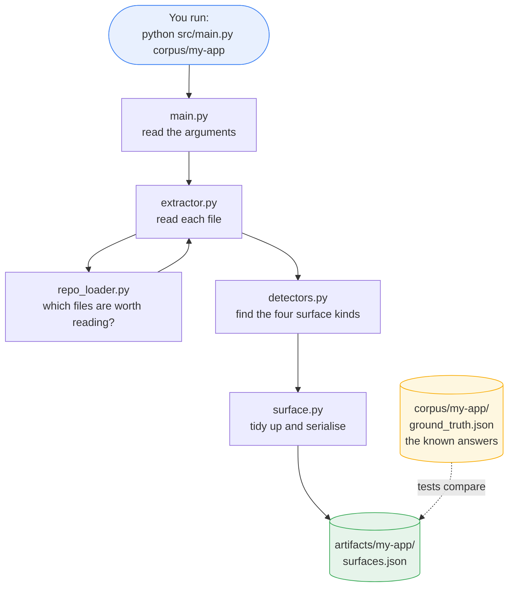
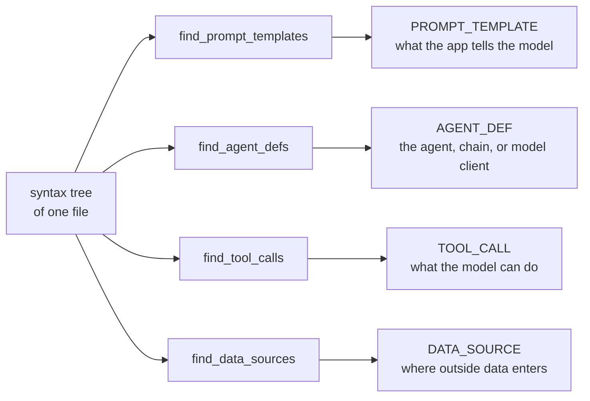
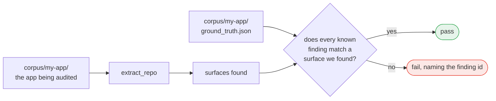
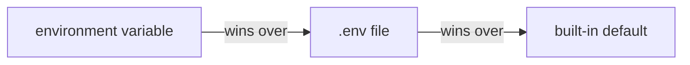
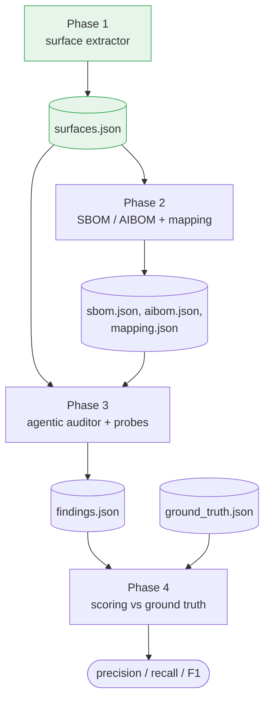

# System flow

How the auditor works today, step by step. Everything on this page is
**implemented and tested** unless it is marked *planned*.

One sentence version: point it at a Python repository, and it walks every
source file's syntax tree looking for the four places an LLM touches the
application, then writes what it found to a JSON file.

---

## 1. The whole picture



The dotted line is the part that makes this a research tool rather than just a
script: the answers are known in advance, so the output can be **scored**.

---

## 2. Step by step

### Step 1 — Read the arguments (`main.py`)

```sh
python src/main.py corpus/vuln-app-1-support-agent
```

`build_parser()` takes the repository path, plus an optional `--artifacts-dir`.
The path is the only required input: nothing about which app to audit is
hardcoded anywhere.

### Step 2 — Decide which files to read (`repo_loader.py`)

`list_python_files()` walks the repository and keeps every `.py` file, except:

| Skipped | Why | Constant |
|---|---|---|
| `.git`, `.venv`, `__pycache__`, `node_modules`, … | not the app's own code | `SKIP_DIRS` |
| files over 1 MB | generated or vendored, not hand-written | `MAX_FILE_BYTES` |

`list_python_files()` itself stays pure and just returns the list; `main.py`
asks `list_oversized_files()` separately and **reports the skips on stderr**,
so nothing is dropped silently — a missed file could be a missed vulnerability.

A path that does not exist raises immediately, naming the path.

### Step 3 — Turn each file into a syntax tree (`extractor.py`)

`extract_repo()` loops the file list and calls `extract_file()` on each.
`parse_file()` reads the source with `tokenize.open` (which honours a file's
own encoding declaration) and hands it to `ast.parse`.

Each file is labelled with its path **relative to the repository root**, in
POSIX form. That is what makes the output identical on Windows, WSL, and Linux.

### Step 4 — Run the four detectors (`detectors.py`)

This is the heart of Phase 1. Four independent detectors, one per surface kind.
Each one walks the tree flatly with `ast.walk` and never calls the others:



| Detector | Looks for | Example it catches |
|---|---|---|
| `find_prompt_templates` | prompt classes, and text assigned to a prompt-shaped name — literals, f-strings, `.format()`, concatenation | `system_msg = """Assistant helps…"""` at `main.py:21` |
| `find_agent_defs` | agent and chain factories, and model clients | `AgentExecutor.from_agent_and_tools(...)` at `main.py:71` |
| `find_tool_calls` | `@tool` functions, `Tool(...)` constructors, tool subclasses | `Tool(name='GetUserTransactions')` at `tools.py:40` |
| `find_data_sources` | file reads, HTTP calls, database queries, retrieval, web route handlers | `st.chat_input(...)` at `main.py:60` |

The names each detector recognises live in **`detector_names.py`**, as plain
constants. Supporting a new framework means adding a name to a set there, not
rewriting a detector.

Every detector also builds a small import table for the file
(`ast_utils.build_import_table`) so each finding records which package it came
from — `langchain_experimental.sql`, for example. Phase 2 uses that to join a
surface to an SBOM component.

**What Phase 1 deliberately does not do:** it records *where* untrusted data
enters, but not whether that data reaches a prompt or a tool. Following the
flow is taint analysis, and that is a Phase 3 probe.

### Step 5 — Tidy up and write the file (`surface.py` → `main.py`)

`surfaces_to_json()` deduplicates, sorts by `(file, line, kind, name)`, and
serialises. Two runs on the same repository produce **byte-identical** output.

Each record gets an `id` built from its own content, `file:line:kind:name`, so
later phases can point at a surface without repeating four fields.

`main.py` writes the result to `artifacts/<app>/surfaces.json`. A repository
with no surfaces is a valid answer, not an error: the file is still written
with `surface_count: 0`, so "audited, found nothing" is distinguishable from
"never audited".

---

## 3. How it is checked



A finding matches when the file and the surface kind are equal and the line is
within 3 of the recorded range. Exact line equality would be wrong, because a
detector may report a decorator line where a human noted the `def`.

Failures name the finding, not just the assertion:

```
AssertionError: VULN2-03: no AGENT_DEF surface extracted for
.../llm_shell_chain.py lines 27-42 (ground truth line 30, name 'PALChain')
```

---

## 4. Settings and the model client

Two pieces exist but sit outside the extraction flow above.

**`config.py`** resolves settings in this order, so nothing machine-specific is
written into the source:



**`model_client.py`** sends a prompt to the local Ollama server and returns the
text. It is fully working — `python src/model_client.py` answers — but **no
detection logic uses it yet**. Phase 1 is deterministic static analysis; the
model is set up here so Phase 3 can start immediately.

---

## 5. Where the later phases attach

*Planned — none of this is built yet.*



Each phase reads the previous phase's JSON, which is why those files are
treated as contracts. The field lists are in [`SCHEMAS.md`](./SCHEMAS.md).

---

## 6. Module map

| File | Its one job |
|---|---|
| `main.py` | command line entry point |
| `repo_loader.py` | which files to analyse |
| `extractor.py` | parse a file, run the detectors, walk a repo |
| `detectors.py` | the four detectors |
| `detector_names.py` | the framework names each detector looks for |
| `ast_utils.py` | shared syntax-tree helpers |
| `surface.py` | the data model and stable JSON output |
| `config.py` | settings, from the environment |
| `model_client.py` | talk to the local model (Phase 3) |

Every module stays under the project's 200-line cap, so none of them grows
into a file that does two jobs.

Call direction is one-way — `main` → `extractor` → `detectors` → `surface` —
so any file can be read on its own without chasing a cycle.
