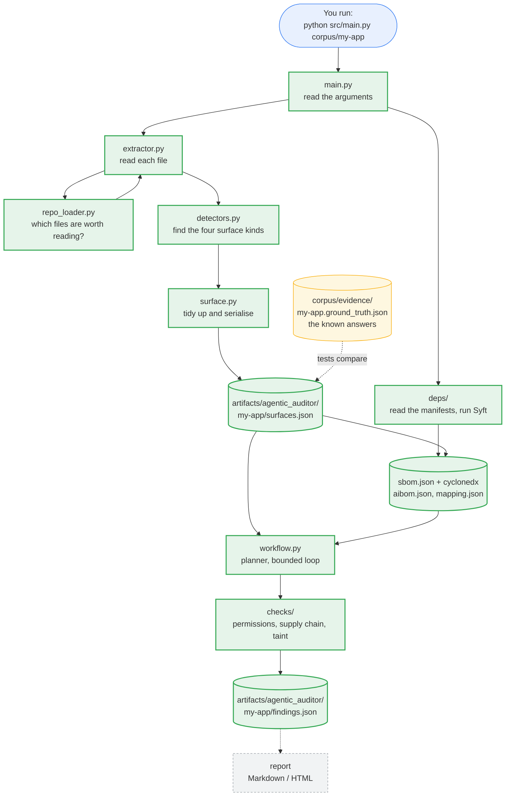
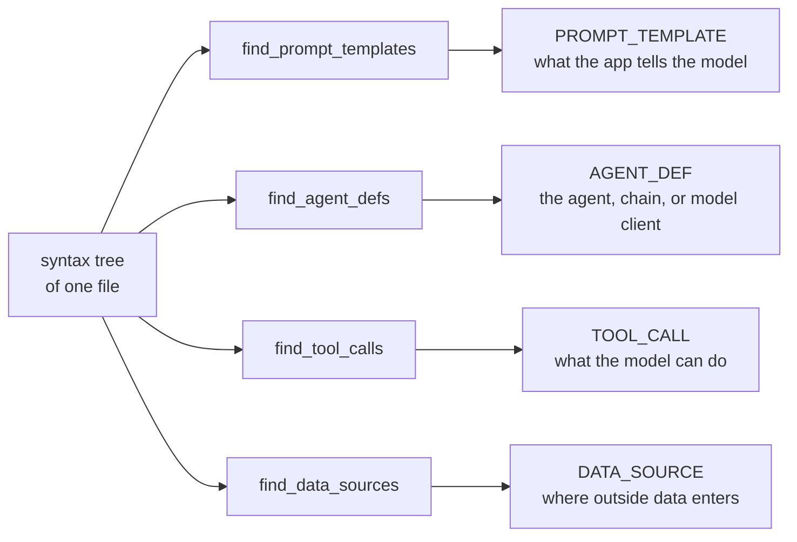
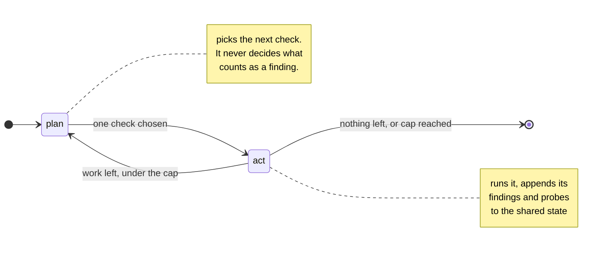
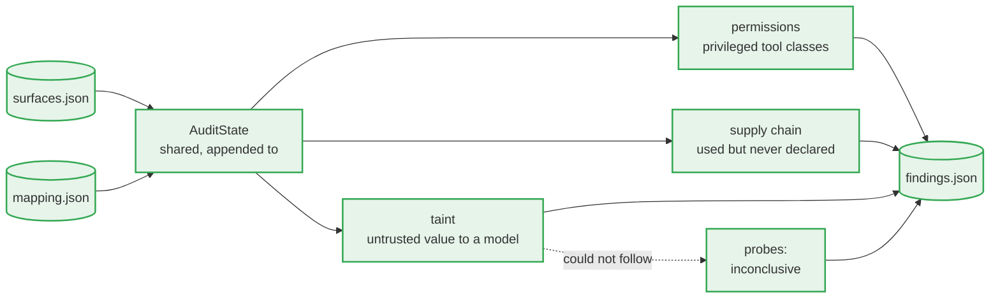
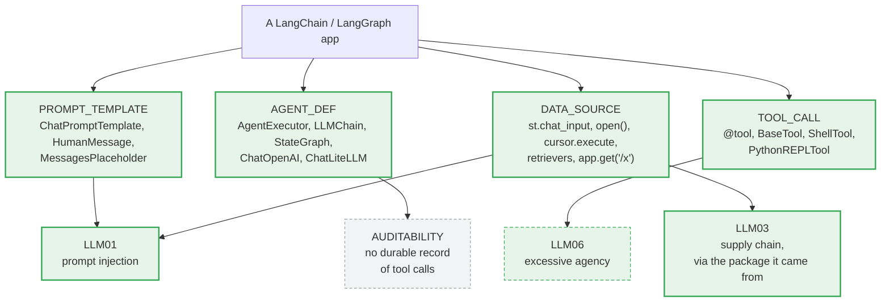
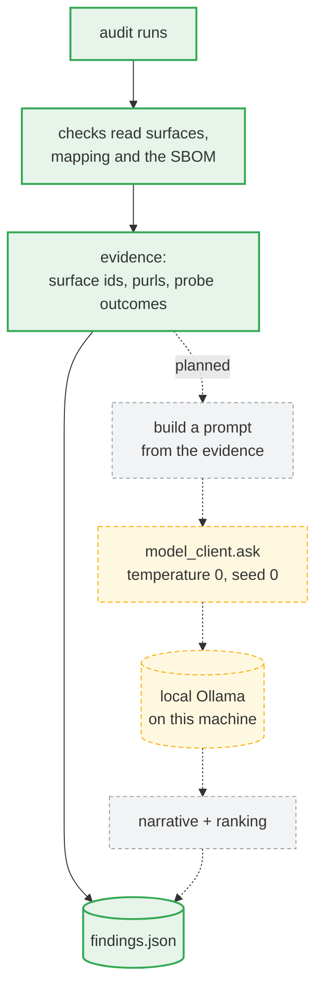
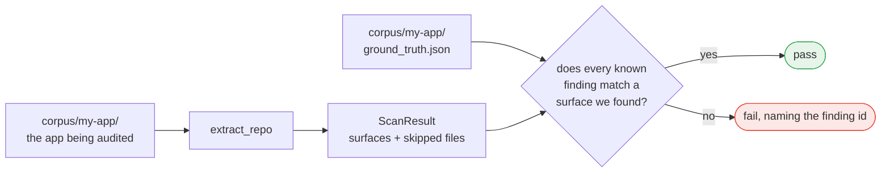
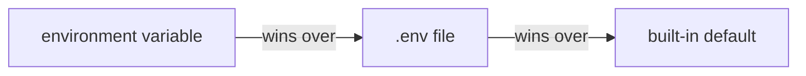
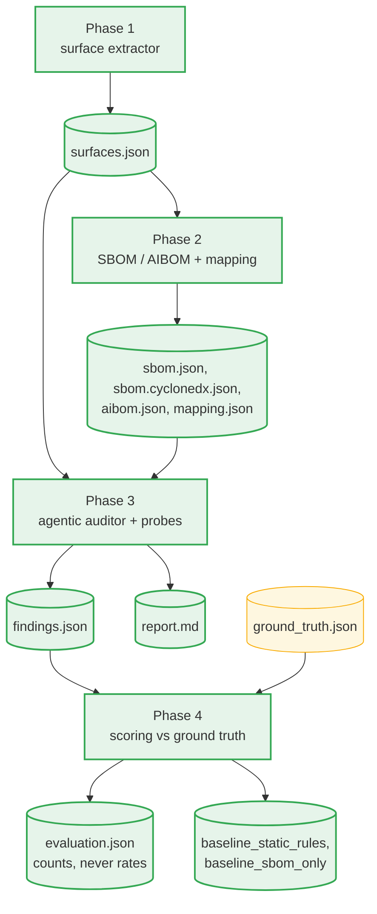

# System flow

How the auditor works today, step by step. Everything on this page is
**implemented and tested** unless it is marked *planned*.

One sentence version: point it at a repository, and it walks every
source file's syntax tree looking for the four places an LLM touches the
application, then writes what it found to a JSON file.

---

## 1. The whole picture

**Green means built and tested today.** Anything not green is planned and does
not run yet, so a reader can tell the tool from the roadmap at a glance.



The dotted line is the part that makes this a research tool rather than just a
script: the answers are known in advance, so the output can be **scored**.

---

## 2. Step by step

### Step 1 — Read the arguments (`main.py`)

```sh
python src/main.py corpus/vuln-app-1-support-agent
```

`build_parser()` takes the repository path, plus an optional `--artifacts-dir`.
The path is the only required input, and the tool makes no network call at any
point: nothing leaves the machine.

The audited app's source is not committed to this repository — it is a
third-party project, downloaded once with the command in the README and
pinned to the commit its grading key was written against.

### Step 2 — Decide which files to read (`repo_loader.py`)

`list_source_files()` walks the repository and keeps every `.py` file, except:

| Skipped | Why | Constant |
|---|---|---|
| `.git`, `.venv`, `__pycache__`, `node_modules`, … | not the app's own code | `SKIP_DIRS` |
| files over 1 MB | generated or vendored, not hand-written | `MAX_FILE_BYTES` |
| `*.d.ts`, `*.min.js`, `*.bundle.js` | declarations and bundles: no behaviour to audit | `IGNORED_SUFFIXES` |

`list_source_files()` itself stays pure and just returns the list; `main.py`
asks `list_oversized_files()` separately and **reports the skips on stderr**,
so nothing is dropped silently — a missed file could be a missed vulnerability.

A path that does not exist raises immediately, naming the path.

### Step 3 — Turn each file into a syntax tree (`extractor.py`)

The auditor reads more than one language, so this is where it picks a parser.
`languages.py` maps the file extension to a language, and `extractor.py`
dispatches:

| Language | Parser | Why |
|---|---|---|
| Python | the standard library's `ast` | it resolves imports properly, which a tree-sitter query cannot do without reimplementing module semantics |
| JavaScript, TypeScript | tree-sitter | the standard library has no JavaScript parser |

Two backends is a deliberate choice, and it has an honest cost: two name
tables (`detector_names.py` and `detector_names_js.py`) that can drift apart.
What keeps the seam invisible is that both produce the same `Surface` type, so
nothing downstream knows or cares which parser ran.

One trap worth naming: `.jsx` is *JavaScript* the language but needs
tree-sitter's *TSX* grammar to parse its embedded markup. `languages.py` keeps
those two ideas in separate tables for exactly that reason.

`extract_repo()` loops the file list and calls `extract_file()` on each.
On the Python side, `read_source()` reads the source with `tokenize.open`
(which honours a file's own encoding declaration) and `parse_file()` hands it to
`ast.parse`. The two are separate functions on purpose: the standard library
reports a bad *encoding* and a bad *statement* both as `SyntaxError`, so only
the call site can tell those two skip reasons apart.
On the JavaScript side, `parse_source()` has to check `root_node.has_error`
itself and raise: tree-sitter never raises on bad syntax, it just returns a
tree full of ERROR nodes, so an unchecked malformed file would silently yield
zero surfaces.

Both backends raise `UnreadableSource`, which carries the reason. **The walk
catches it and keeps going**, returning a `ScanResult` of the surfaces found
*and* the files it could not read — one unparseable vendored file costs that
file, not the whole audit. Only `UnreadableSource` is caught: a detector's own
`ValueError` is a bug and stays loud, which matters because
`UnicodeDecodeError` is itself a `ValueError` subclass and a broad `except`
would file a detector bug as a deliberate skip.

Each file is labelled with its path **relative to the repository root**, in
POSIX form. That is what makes the output identical on Windows, WSL, and Linux.

### Step 4 — Run the four detectors (`detectors.py`, `detectors_js.py`)

This is the heart of Phase 1. Four independent detectors, one per surface kind.
Each one walks the tree flatly with `ast.walk` and never calls the others:



| Detector | Looks for | Example it catches |
|---|---|---|
| `find_prompt_templates` | prompt classes, and text assigned to a prompt-shaped name — literals, f-strings, `.format()`, concatenation | `system_msg = """Assistant helps…"""` at `main.py:21` |
| `find_agent_defs` | agent and chain factories, and model clients | `AgentExecutor.from_agent_and_tools(...)` at `main.py:71` |
| `find_tool_calls` | `@tool` functions, `Tool(...)` constructors, tool subclasses | `Tool(name='GetUserTransactions')` at `tools.py:40` |
| `find_data_sources` | file reads, HTTP calls, database queries, retrieval, web route handlers | `st.chat_input(...)` at `main.py:60` |

The names each detector recognises live in **`detector_names.py`** (Python) and
**`detector_names_js.py`** (JavaScript/TypeScript), as plain constants.
Supporting a new framework means adding a name to a set there, not rewriting a
detector.

Every detector also builds a small import table for the file
(`ast_utils.build_import_table`) so each finding records which package it came
from — `langchain_experimental.sql`, for example. Phase 2 uses that to join a
surface to an SBOM component.

**What Phase 1 deliberately does not do:** it records *where* untrusted data
enters, but not whether that data reaches a prompt or a tool. Following the
flow is taint analysis, and that is a Phase 3 probe.

### Step 5 — Tidy up and write the file (`surface.py` → `main.py`)

`surfaces_to_json()` deduplicates, sorts by `(file, line, kind, name)`, and
serialises. Two runs on the same repository produce **byte-identical** output.

Each record gets an `id` built from its own content, `file:line:kind:name`, so
later phases can point at a surface without repeating four fields.

`main.py` writes the result to `artifacts/<system>/<app>/surfaces.json`, where
`<system>` is `agentic_auditor` for the tool's own run. A repository
with no surfaces is a valid answer, not an error: the file is still written
with `surface_count: 0`, so "audited, found nothing" is distinguishable from
"never audited".

The unreadable files are written into the same document as `skipped_files`, and
also printed. Recording them beside the surfaces is deliberate: Phase 4 scores
recall from this file, and a skip mentioned only in a console log would make a
missed surface indistinguishable from a detector that failed to find one.
`docs/SCHEMAS.md` states what a scorer must do about it.

---

## 3. The audit loop, on LangGraph

Phase 3 plans its own work. The auditor is itself an agentic LLM app, which is
why it is built with the same framework as the apps it audits -- not because a
bounded loop needs one.



Three things about that loop matter more than its shape.

**The cap is a mechanism, not a promise.** `MAX_STEPS = 20`. An unbounded
planner over someone else's repository is exactly what the safety boundary
exists to prevent, so the loop stops whether or not work remains, and a test
proves it stops with work outstanding.

**The planner chooses which check runs, and nothing else.** What counts as a
finding stays with the checks, which read evidence and cite it. A planner that
decided findings would be a second detector, and Phase 4 grades the detectors.

**Only checks with something to examine are planned.** The taint trace reads an
`ast` tree, so on a JavaScript app it is never handed to the planner and never
appears in `coverage.checks_run` -- because a check listed there and silent
means "looked, found nothing", which would be a false claim.



---

## 4. What it looks for in a LangChain or LangGraph app

The four surface kinds are not abstract: each is a set of framework names the
detectors match. This is what makes the auditor specific to LLM applications
rather than a general linter.



Green is reported today. `MessagesPlaceholder` is kept in the prompt table on
purpose: a history slot is exactly where an indirect injection lands.

LLM06 is dashed because only half of it is reached. A privileged tool class is
found; a tool that accepts any identifier without checking who asked -- which
is what the corpus actually grades -- needs the dataflow to reason about a
missing check rather than a present capability. AUDITABILITY is grey: proving
an app keeps no durable record of its tool calls means reasoning about absence,
which no check does yet.

---

## 5. When the local model is called

**Today: never, during an audit.** Every artifact this tool produces is written
by deterministic static analysis. Nothing in `src/` outside `model_client.py`
calls it, and every run records `model_run.status: "disabled"` with each
finding's `narrative` left null.

That is deliberate, not an oversight. What the model is for is *explaining
evidence this project already gathered* -- never finding it, and never
classifying it, because classification is exactly what Phase 4 scores. A
finding the model invented would be a finding no artifact backs.



Green runs today. Amber is built and tested but reached only by hand --
`python src/model_client.py` answers, and its decoding settings are pinned.
Grey is not written yet.

**Where the model would join, and what bounds it.** Only two fields in
`findings.json` may ever be model-authored: each finding's `narrative`, and
`model_run.ranking`. Not `owasp_id`, not `file`, not `line` -- those are copied
from evidence. Not `severity` or `confidence` -- the grading key has no such
field, so nothing could check them. And never a suggested fix, which would be
one copy-paste from crossing the no-auto-patching boundary.

**Why `status` has three values.** `disabled` means nobody asked for prose;
`unavailable` means it was asked for and the server did not answer;
`used` names the model and records the settings sent. A reader must be able to
tell a run with no narrative from a run whose narrative failed, which is the
same distinction `skipped_files` and the probe outcomes make elsewhere.

**The model never leaves the machine.** It is a local Ollama server, and the
decoding settings are fixed -- temperature 0, seed 0 -- so a recorded run can
be repeated rather than merely described. LangGraph brought `langsmith` into
the dependency tree, whose tracing would have posted node inputs and outputs
off the machine; `workflow.py` disables it by assignment before importing
langgraph, and the offline test covers a full audit under a blocked socket.

---

## 6. How it is checked



A finding matches when the file and the surface kind are equal and the line is
within 3 of the recorded range. Exact line equality would be wrong, because a
detector may report a decorator line where a human noted the `def`.

Failures name the finding, not just the assertion:

```
AssertionError: VULN2-03: no AGENT_DEF surface extracted for
.../llm_shell_chain.py lines 27-42 (ground truth line 30, name 'PALChain')
```

---

## 7. Settings and the model client

Two pieces exist but sit outside the extraction flow above.

**`config.py`** resolves settings in this order, so nothing machine-specific is
written into the source:



**`model_client.py`** sends a prompt to the local Ollama server and returns the
text. Section 5 covers when it is called, which is currently never during an
audit.

---

## 8. Where the later phases attach

Phases 1 and 2 are built and tagged. Phase 3 is built: a planner runs three
checks over one app, writes `findings.json`, and renders `report.md`, which
gives what was *not* examined the same billing as what was found. It reaches
two of the six findings in the vulnerable fixture's grading key and none of the
five surfaces in the clean TypeScript one -- no false positives. What is left in Phase 3
is using the model for prose: every run so far records
`model_run.status: "disabled"`.

Phase 4 is built: `src/evaluate.py` scores the corpus and both baselines exist
(`src/baselines/`, run by `src/run_baseline.py`). The comparison is done, and
the grep baseline reaches more of the grading key than the auditor does -- 5 of
6 against 2 of 6. What the auditor reaches alone is the supply-chain finding,
which needs a surface-to-component join neither baseline has.



Every box is green: all four phases produce their artifacts today. Amber is the
hand-written grading key, which is this project's own evidence rather than
something the tool generates.

What is *not* built is inside the boxes rather than beside them — the model
writes nothing in any run, no advisory data is ingested, and the auditor covers
three of the five risk classes it names.

`evaluation.json` holds counts and never a rate: precision, recall and F1 are
absent as fields so that no number can be quoted without its denominator.

Each phase reads the previous phase's JSON, which is why those files are
treated as contracts. The field lists are in [`SCHEMAS.md`](./SCHEMAS.md).

---

## 9. Module map

`src/` groups modules by what they do. The folders are plain directories, not
packages — Python imports them without an `__init__.py`, so there are no empty
files to explain.

**It is deliberately not an installable package.** `python src/main.py` runs it
and `tests/conftest.py` puts `src/` on the path; making it a package would mean
rewriting every import and invoking it as `python -m`, for no gain a reader
would notice.

| Folder | What it holds |
|---|---|
| `parsing/` | turning a repository's source files into syntax trees |
| `detectors/` | finding the four kinds of LLM surface in a tree |
| `artifacts/` | the JSON documents each run produces, and their shapes |
| `deps/` | reading an app's dependencies, and matching imports to packages |
| `checks/` | deciding what to look for, and planning which check runs next |

| File | Its one job |
|---|---|
| `main.py` | command line entry point: audit one app |
| `evaluate.py` | command line entry point: score the corpus against its keys |
| `languages.py` | which extension is which language, and which grammar reads it |
| `corpus_paths.py` | where the corpus keeps code, and where it keeps evidence |
| `repo_loader.py` | which files to analyse |
| `extractor.py` | pick the backend for a file, and walk a repository |
| `extractor_python.py` | parse Python with `ast`, run the Python detectors |
| `extractor_js.py` | parse JS/TS with tree-sitter, run the JS detectors |
| `detectors.py` | the four detectors, Python |
| `detectors_js.py` | the prompt, agent and tool detectors, JavaScript |
| `data_sources_js.py` | where outside data enters, JavaScript |
| `surface_builder_js.py` | build a Surface from a tree-sitter node |
| `detector_names.py` | the framework names, Python |
| `detector_names_js.py` | the framework names, JavaScript and TypeScript |
| `ast_utils.py` | shared `ast` helpers |
| `ts_utils.py` | shared tree-sitter helpers |
| `surface.py` | the data model and stable JSON output |
| `skipped_file.py` | the record for a file the scan could not read |
| `repo_path.py` | the path rule every artifact path field obeys |
| `finding.py` | one conclusion and the evidence it cites; one probe result |
| `findings_document.py` | assemble findings.json, and strip what a model wrote |
| `bindings.py` | which name a call's result was bound to, within one file |
| `workflow.py` | the planner and its bounded loop, on LangGraph |
| `run_checks.py` | which checks have something to examine on this app |
| `permissions.py` | tools granting shell, interpreter or network access |
| `supply_chain.py` | packages used but never declared |
| `taint.py` | untrusted values reaching a model or a model-driven tool |
| `config.py` | settings, from the environment |
| `model_client.py` | talk to the local model (Phase 3) |
| `syft_runner.py` | run the SBOM generator: the only outside process |
| `requirements_parser.py` | what a Python app says it depends on |
| `npm_manifest.py` | what a JavaScript app says it depends on |
| `package_names.py` | each ecosystem's rules for names, pins and purls |
| `sbom.py` | normalise that into a deterministic bill of materials |
| `cyclonedx.py` | re-emit the same scan in the standard CycloneDX format |
| `component_match.py` | which package an import came from |
| `mapping.py` | join each surface to its component, or say why not |
| `aibom.py` | the models, tools and agents, from the surfaces |

Every module stays under the project's 200-line cap, so none of them grows
into a file that does two jobs.

Call direction is one-way:

```
main -> extractor -> extractor_python -> detectors    -> surface
                  \-> extractor_js     -> detectors_js -^
```

so any file can be read on its own without chasing a cycle. The two backends
meet only at `Surface`: nothing downstream knows which parser ran.
