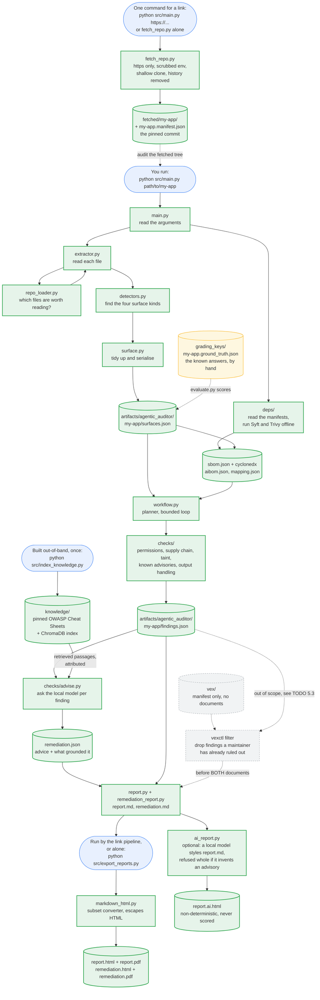
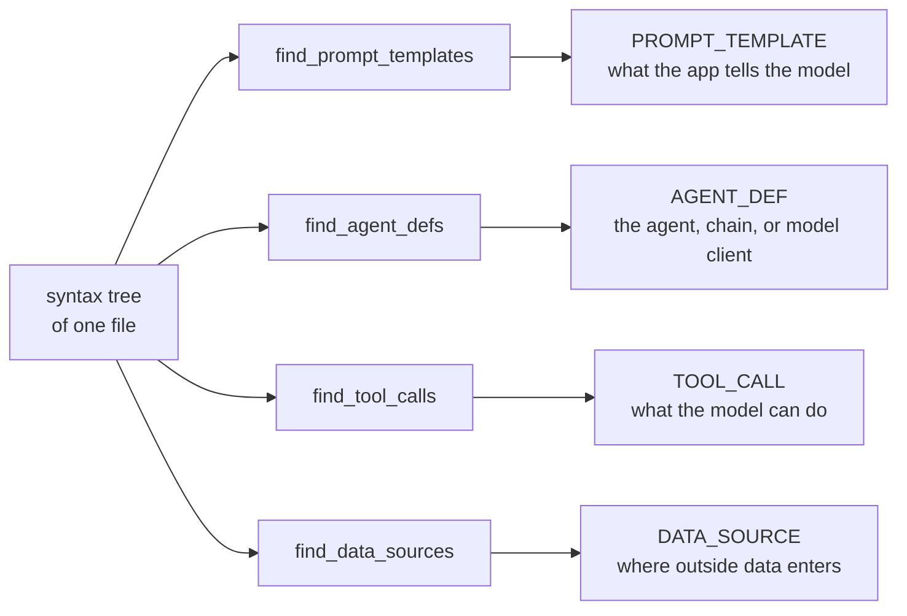
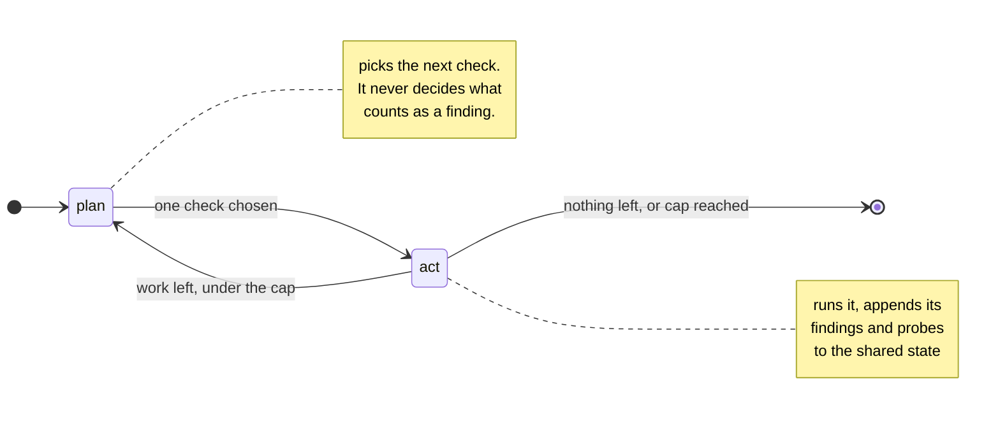
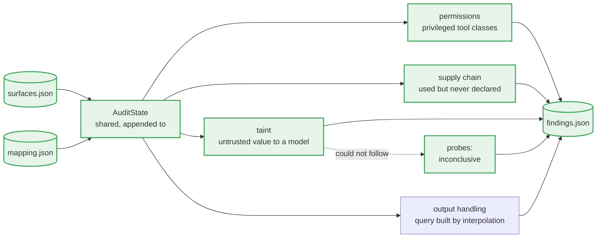
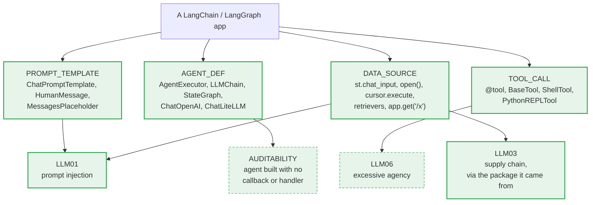
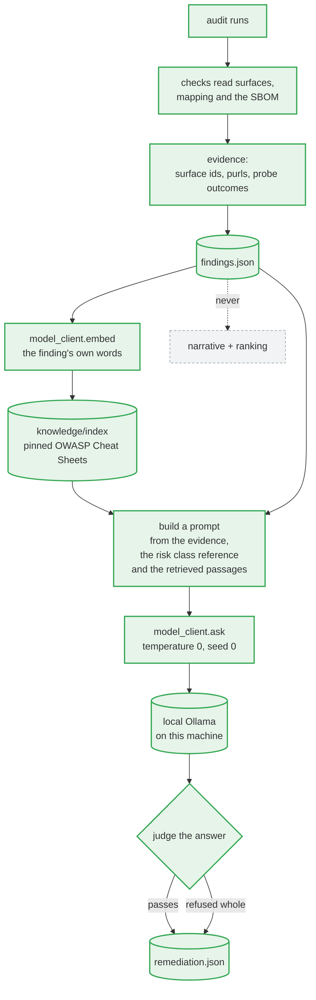
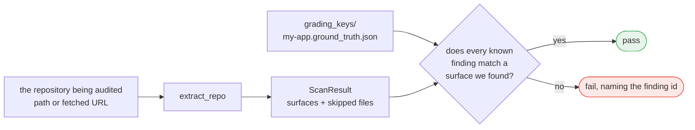
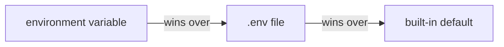
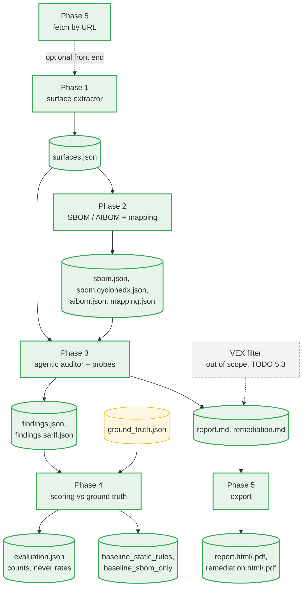
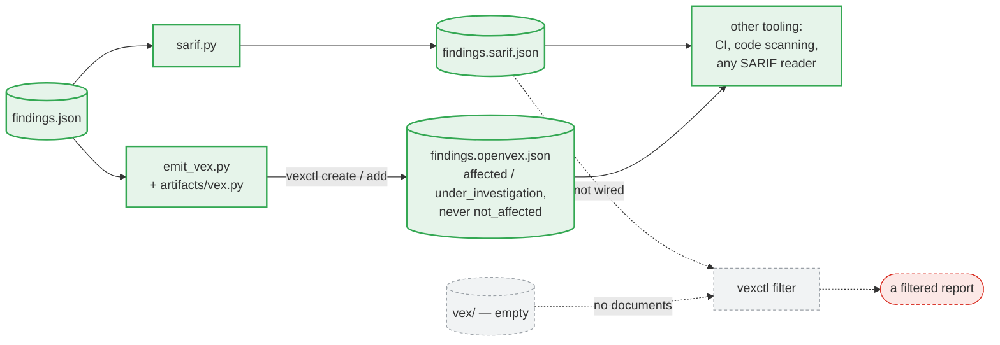

# System flow

How the auditor works today, step by step. Everything on this page is
**implemented and tested** unless it is marked *planned*.

One sentence version: point it at a repository, and it walks every
source file's syntax tree looking for the four places an LLM touches the
application, then writes what it found to a JSON file.

---

## 1. The whole picture

**Green is built and tested today. Grey and dashed is planned and does not run
yet**, so a reader can tell the tool from the roadmap at a glance. Blue is you;
yellow is the grading key the output is scored against.



**A link runs the whole picture as one command.** `python src/main.py
<https-link>` composes the stages above -- fetch, audit, VEX, export, and an
optional AI-formatted view -- through `src/pipeline.py`; a local path runs the
audit alone, which is the path every no-network test holds. The last stage,
`report.ai.html`, is a bonus: if the model is unreachable or its page fails
verification the run still succeeds, because the authoritative `report.html` is
already written.

The yellow dotted line is the part that makes this a research tool rather than
just a script: the answers are known in advance, so the output can be
**scored**.

**The one grey box is the VEX *filter*, now out of scope.** Emission is built
and is a separate command; what is grey here is *consuming* someone else's
statements, closed for the measured reasons TODO 5.3 records and revived only
by an upstream document plus a product-aware filter. Its position stays
settled: before both documents. It sits
between `findings.json` and the two documents rather than after them, so a
finding a maintainer has already ruled out is gone before *either* the report or
the model's advice mentions it — otherwise the two documents would disagree
about what the app's problems are. It does not run today, but its first
blocker fell with advisory ingestion: a `known_advisory` finding's SARIF
`ruleId` is now a CVE/GHSA id, which is exactly what `vexctl filter` joins on.
What remains is that no upstream VEX document exists for any dependency of any
fixture — and section 9's caveat that the filter ignores the product, so wiring
it needs care, not just data.

---

## 2. Step by step

### Step 1 — Read the arguments (`main.py`)

```sh
python src/main.py path/to/my-app
```

`build_parser()` takes the repository path, plus an optional `--artifacts-dir`.
The path is the only required input, and the tool makes no network call at any
point: nothing leaves the machine.

The audited app's source is not committed to this repository — it is a
third-party project, downloaded once with the command in the README and
pinned to the commit its grading key was written against.

### Step 2 — Decide which files to read (`repo_loader.py`)

`list_source_files()` walks the repository and keeps every `.py` file, except:

| Skipped | Why | Constant |
|---|---|---|
| `.git`, `.venv`, `__pycache__`, `node_modules`, … | not the app's own code | `SKIP_DIRS` |
| files over 1 MB | generated or vendored, not hand-written | `MAX_FILE_BYTES` |
| `*.d.ts`, `*.min.js`, `*.bundle.js` | declarations and bundles: no behaviour to audit | `IGNORED_SUFFIXES` |

`list_source_files()` itself stays pure and just returns the list; `main.py`
asks `list_oversized_files()` separately and **reports the skips on stderr**,
so nothing is dropped silently — a missed file could be a missed vulnerability.

A path that does not exist raises immediately, naming the path.

### Step 3 — Turn each file into a syntax tree (`extractor.py`)

The auditor reads more than one language, so this is where it picks a parser.
`languages.py` maps the file extension to a language, and `extractor.py`
dispatches:

| Language | Parser | Why |
|---|---|---|
| Python | the standard library's `ast` | it resolves imports properly, which a tree-sitter query cannot do without reimplementing module semantics |
| JavaScript, TypeScript | tree-sitter | the standard library has no JavaScript parser |

Two backends is a deliberate choice, and it has an honest cost: two name
tables (`detector_names.py` and `detector_names_js.py`) that can drift apart.
What keeps the seam invisible is that both produce the same `Surface` type, so
nothing downstream knows or cares which parser ran.

One trap worth naming: `.jsx` is *JavaScript* the language but needs
tree-sitter's *TSX* grammar to parse its embedded markup. `languages.py` keeps
those two ideas in separate tables for exactly that reason.

`extract_repo()` loops the file list and calls `extract_file()` on each.
On the Python side, `read_source()` reads the source with `tokenize.open`
(which honours a file's own encoding declaration) and `parse_file()` hands it to
`ast.parse`. The two are separate functions on purpose: the standard library
reports a bad *encoding* and a bad *statement* both as `SyntaxError`, so only
the call site can tell those two skip reasons apart.
On the JavaScript side, `parse_source()` has to check `root_node.has_error`
itself and raise: tree-sitter never raises on bad syntax, it just returns a
tree full of ERROR nodes, so an unchecked malformed file would silently yield
zero surfaces.

Both backends raise `UnreadableSource`, which carries the reason. **The walk
catches it and keeps going**, returning a `ScanResult` of the surfaces found
*and* the files it could not read — one unparseable vendored file costs that
file, not the whole audit. Only `UnreadableSource` is caught: a detector's own
`ValueError` is a bug and stays loud, which matters because
`UnicodeDecodeError` is itself a `ValueError` subclass and a broad `except`
would file a detector bug as a deliberate skip.

Each file is labelled with its path **relative to the repository root**, in
POSIX form. That is what makes the output identical on Windows, WSL, and Linux.

### Step 4 — Run the four detectors (`detectors.py`, `detectors_js.py`)

This is the heart of Phase 1. Four independent detectors, one per surface kind.
Each one walks the tree flatly with `ast.walk` and never calls the others:



| Detector | Looks for | Example it catches |
|---|---|---|
| `find_prompt_templates` | prompt classes, and text assigned to a prompt-shaped name — literals, f-strings, `.format()`, concatenation | `system_msg = """Assistant helps…"""` at `main.py:21` |
| `find_agent_defs` | agent and chain factories, and model clients | `AgentExecutor.from_agent_and_tools(...)` at `main.py:71` |
| `find_tool_calls` | `@tool` functions, `Tool(...)` constructors, tool subclasses | `Tool(name='GetUserTransactions')` at `tools.py:40` |
| `find_data_sources` | file reads, HTTP calls, database queries, retrieval, web route handlers | `st.chat_input(...)` at `main.py:60` |

The names each detector recognises live in **`detector_names.py`** (Python) and
**`detector_names_js.py`** (JavaScript/TypeScript), as plain constants.
Supporting a new framework means adding a name to a set there, not rewriting a
detector.

Every detector also builds a small import table for the file
(`ast_utils.build_import_table`) so each finding records which package it came
from — `langchain_experimental.sql`, for example. Phase 2 uses that to join a
surface to an SBOM component.

**What Phase 1 deliberately does not do:** it records *where* untrusted data
enters, but not whether that data reaches a prompt or a tool. Following the
flow is taint analysis, and that is a Phase 3 probe.

### Step 5 — Tidy up and write the file (`surface.py` → `main.py`)

`surfaces_to_json()` deduplicates, sorts by `(file, line, kind, name)`, and
serialises. Two runs on the same repository produce **byte-identical** output.

Each record gets an `id` built from its own content, `file:line:kind:name`, so
later phases can point at a surface without repeating four fields.

`main.py` writes the result to `artifacts/<system>/<app>/surfaces.json`, where
`<system>` is `agentic_auditor` for the tool's own run. A repository
with no surfaces is a valid answer, not an error: the file is still written
with `surface_count: 0`, so "audited, found nothing" is distinguishable from
"never audited".

The unreadable files are written into the same document as `skipped_files`, and
also printed. Recording them beside the surfaces is deliberate: Phase 4 scores
recall from this file, and a skip mentioned only in a console log would make a
missed surface indistinguishable from a detector that failed to find one.
`docs/SCHEMAS.md` states what a scorer must do about it.

---

## 3. The audit loop, on LangGraph

Phase 3 plans its own work. The auditor is itself an agentic LLM app, which is
why it is built with the same framework as the apps it audits -- not because a
bounded loop needs one.



Three things about that loop matter more than its shape.

**The cap is a mechanism, not a promise.** `MAX_STEPS = 20`. An unbounded
planner over someone else's repository is exactly what the safety boundary
exists to prevent, so the loop stops whether or not work remains, and a test
proves it stops with work outstanding.

**The planner chooses the order the checks run in, and -- since task 7.4 --
which surfaces each check examines. It never chooses which checks run, and never
what counts as a finding.** The order is fixed before the graph starts and
the `plan` node takes the first check still outstanding. Since task 7.2 a local
model may choose that order, at the edge in `build_findings`, so the graph still
opens no socket; the choice is recorded in `planner.json`.

**The order alone changes nothing else.** `coverage.checks_run` is sorted,
findings and probes are sorted, and every eligible check runs whatever the model
says -- so the order alters no other byte of any artifact unless `MAX_STEPS`
binds, which six graph checks against a cap of twenty cannot make happen.

**Task 7.4 is what makes the planner consequential**, and it is the one place a
model can reduce what an audit examines. It may narrow a check to a subset of
its surfaces, so a finding can go unfound because the model did not look. Five
rules keep that from becoming a silent claim: a check the model does not name
runs on every surface; an empty selection is refused rather than honoured; a
narrowing may never take a check below one surface; surfaces the prompt never
described always run; and the two component-anchored checks -- supply chain and
known advisories -- are not narrowable at all, because filtering them would drop
components from both sides of the coverage ledger. What each check actually
examined is recorded in `coverage.checks_narrowed`. What counts as a
finding stays with the checks, which read evidence and cite it. A planner that
decided findings would be a second detector, and Phase 4 grades the detectors.

This sentence used to say the planner chooses *which* check runs, which implied
a different power: a check the planner dropped would be absent from
`coverage.checks_run`, which the scorer reads as `no_check_for_risk_class`. That
remains forbidden. Narrowing *within* a named check is what 7.4 allows, and a
name in `checks_run` therefore no longer implies every eligible surface --
`coverage.checks_narrowed` says how many it examined.

**Only checks with something to examine are planned.** The taint trace reads an
`ast` tree, so on a JavaScript app it is never handed to the planner and never
appears in `coverage.checks_run` -- because a check listed there and silent
means "looked, found nothing", which would be a false claim.



---

## 4. What it looks for in a LangChain or LangGraph app

The four surface kinds are not abstract: each is a set of framework names the
detectors match. This is what makes the auditor specific to LLM applications
rather than a general linter.



Green is reported today. `MessagesPlaceholder` is kept in the prompt table on
purpose: a history slot is exactly where an indirect injection lands.

LLM06 is dashed because only half of it is reached. A privileged tool class is
found; a tool that accepts any identifier without checking who asked -- which
is what a grading key actually grades -- needs the dataflow to reason about a
missing check rather than a present capability.

AUDITABILITY is dashed for the same kind of reason. `auditability.py` reports
one structural fact -- an agent constructed with no callback or handler
argument -- and that is not the same as proving the app keeps no durable record
of its tool calls. An app that logs through a decorator, middleware or a config
file is still reported, and one that attaches a display widget at invocation
rather than construction is not. Proving absence would need reasoning no check
does.

---

## 5. When the local model is called

**In three places, and never into a scored artifact.** During the audit itself,
`src/checks/advise.py` asks the local model how to fix each finding, once per
finding, and the answer goes to `remediation.json`. Since Phase 6 that same
audit makes a second kind of call, to the same server and through the same
module: `src/retrieval/retrieve.py` asks the local *embedding* model to turn a
finding's title and evidence into a vector, so the knowledge base can be
searched for passages to put in the prompt -- once per run to prove the server
is there, once per finding to search. Nothing else in the audit calls a model.
The link pipeline then makes a third call *after* the audit: `src/ai_report.py`
hands the finished `report.md` to a model (gemma by default) to restyle as
`report.ai.html`, an optional view refused whole if it invents an advisory. All
three land outside the scored path, so no word a model chose can reach
`findings.json` or the scorer.

**Grounding the advice: what retrieval changes and what it deliberately does
not.** The prompt now carries two things it did not before -- a fixed reference
entry for the finding's risk class, and up to three passages retrieved from a
pinned local copy of the OWASP Cheat Sheet Series, indexed in ChromaDB. Every
passage used is attributed in `remediation.json`'s `sources`, so a reader can
open the page the advice leaned on, and the run's `knowledge_base` block records
which index was read or why none was. Confined to advice: nothing here touches
`findings.json`, `owasp_id`, `model_run` or the scorer, and `src/evaluation/` is
barred from importing `retrieval` by the same source guard that bars it from
reading the grading key.

This is **not** a reversal of the Phase 0 decision to drop LLM08. That dropped
retrieval as a *risk class the auditor detects*, because no graded app
retrieves. This adds retrieval as a *mechanism the auditor uses on its own
advice*. Two different things.

**Retrieval degrades separately from the model, and says which failed.** An
unreachable chat model and an unbuilt index are two different absences, so they
are recorded in two blocks. `probe()` runs once per audit and owns every reason
a run is ungrounded -- `no_index`, `index_stale`, `embed_unavailable`,
`embed_model_missing` -- and a per-finding retrieval failure costs that finding
its grounding, is said on stderr, and never fails the audit. With no index at
all the advice is written exactly as it was before Phase 6, which is why the
knowledge base is a setup step and not a prerequisite. See `SCHEMAS.md` under
`knowledge/manifest.json` for the pin and the two ChromaDB defaults that are
switched off.

**What it does not touch is the point.** `findings.json` is written before the
model is asked anything and is never revisited, so it still records
`model_run.status: "disabled"`, every `narrative` is null, and the file is
byte-identical whether the model ran or not. The scorer opens three files and
`remediation.json` is not one of them, so model prose is *structurally* unable
to reach a score -- a property of the layout rather than a rule to remember.

What the model is for is *explaining evidence this project already gathered* --
never finding it, and never classifying it, because classification is exactly
what Phase 4 scores. A finding the model invented would be a finding no artifact
backs.



Green runs today. Grey is still unwritten: no run has ever set a `narrative` or
a `ranking`, so `findings.json` has never carried a word a model chose.

Note the arrow from `findings.json` into the prompt, not out of the model into
it. Advice is built *from* the finished finding and lands somewhere else.

**Where the model joins, and what bounds it.** Four fields, in two files:
`findings.json`'s `narrative` and `model_run.ranking` (neither written today),
and `remediation.json`'s `guidance` and `snippets`. Not `owasp_id`, not `file`,
not `line` -- those are copied from evidence. Not `severity` or `confidence` --
the grading key has no such field, so nothing could check them. Not `sources`
either: retrieval decides those, and the model is never shown a field it can
write into.

**A suggested fix used to be on that list. It was taken off, on purpose.** This
section read: "And never a suggested fix, which would be one copy-paste from
crossing the no-auto-patching boundary." Per-finding remediation advice was
asked for and the decision was reversed. The concern was not dismissed; it was
given a mechanism, set out in `SCHEMAS.md` under "What the model may write" and
summarised here: advice lives in its own file, never on a scored record; an
answer naming the app's own identifiers or arriving in patch form is refused
whole after the model speaks, and the refusal is recorded; and the guard is a
check on output, because prompt wording was *measured* to leak.

**Why `status` has three values.** `disabled` means nobody asked for prose;
`unavailable` means it was asked for and the server did not answer;
`used` names the model and records the settings sent. A reader must be able to
tell a run with no narrative from a run whose narrative failed, which is the
same distinction `skipped_files` and the probe outcomes make elsewhere.

**The model never leaves the machine.** It is a local Ollama server, and the
decoding settings are fixed -- temperature 0, seed 0 -- so a recorded run can
be repeated rather than merely described. LangGraph brought `langsmith` into
the dependency tree, whose tracing would have posted node inputs and outputs
off the machine; `workflow.py` disables it by assignment before importing
langgraph, and the offline test covers a full audit under a blocked socket.

---

## 6. How it is checked



A finding matches when the file and the surface kind are equal and the line is
within 3 of the recorded range. Exact line equality would be wrong, because a
detector may report a decorator line where a human noted the `def`.

Failures name the finding, not just the assertion:

```
AssertionError: VULN2-03: no AGENT_DEF surface extracted for
.../llm_shell_chain.py lines 27-42 (ground truth line 30, name 'PALChain')
```

---

## 7. Settings and the model client

Two pieces exist but sit outside the extraction flow above.

**`config.py`** resolves settings in this order, so nothing machine-specific is
written into the source:



**`model_client.py`** sends a prompt to the local Ollama server and returns the
text, and embeds text against the same server's embedding model. Section 5
covers when it is called: during an audit for per-finding advice
(`remediation.json`) and to search the knowledge base behind it, and once more
after the audit for the AI-formatted view (`report.ai.html`) -- never into a
scored artifact, and never at all if the server is down. It is the **one**
module under `src/` that opens a network connection, and a test holds that by
name, which is why retrieval asks it for vectors rather than opening a
connection of its own.

---

## 8. Where the later phases attach

Phases 1 and 2 are built and tagged. Phase 3 is built: a planner runs four
checks over one app, writes `findings.json`, and renders `report.md`, which
gives what was *not* examined the same billing as what was found. The model
advises on every finding, into `remediation.json`; `findings.json` stays
model-free by design, so it still records `model_run.status: "disabled"`.

Phase 4 is built: `src/evaluate.py` scores any app with a key, and both baselines exist
(`src/baselines/`, run by `src/run_baseline.py`). On the verified pre-advisory
run the grep baseline reaches more of the grading key than the auditor does --
5 of 6 against 2 of 6, with the auditor alone reaching the finding that needs a
surface-to-component join. Re-measured after advisory ingestion and the
reachability key entry: 3 of 7 against 5 of 7, the auditor at zero false
positives -- figures marked `key_unverified` until a human re-checks the edited
key. The run labels live in `docs/HISTORY.md` and the README.

Phase 5 is built, minus its VEX *filter* (emission ships; see section 9): a repository can be fetched by URL
(`src/fetch_repo.py`) and both reports exported as HTML and PDF
(`src/export_reports.py`). Both are commands of their own rather than flags, so
the audit path itself still reaches no network and needs no renderer installed.
Task 5.3, the VEX filter, is the one grey box in the picture at the top and is
declared out of scope -- see section 9.



Every box is green but one: all five phases produce their artifacts today, and
the grey one is Task 5.3. Amber is the hand-written grading key, which is this
project's own evidence rather than something the tool generates.

What is *not* built is inside the boxes rather than beside them — the model
writes nothing into any *scored* artifact -- it advises, in `remediation.json`,
and `findings.json` is untouched. Advisory data **is** ingested now -- Trivy,
run offline, feeding the `known_advisory` check -- and the auditor now covers
all five risk classes it names. Both of the newest two establish less than
their class does, and say so: `output_handling.py` proves a query was built by
interpolation, not that the model wrote what went in; `auditability.py` proves
no handler was attached where the agent was built, not that its actions go
unrecorded.

`evaluation.json` holds counts and never a rate: precision, recall and F1 are
absent as fields so that no number can be quoted without its denominator.

Each phase reads the previous phase's JSON, which is why those files are
treated as contracts. The field lists are in [`SCHEMAS.md`](./SCHEMAS.md).

---

## 9. VEX: emitted, not consumed

**This project now writes VEX and still reads none, and the asymmetry is the
whole section.** `src/emit_vex.py` runs `vexctl` to author statements from the
audit's own advisory findings; nothing under `src/` opens `vex/`, the folder
that would hold documents to consume, and `tests/test_vex_unread.py` asserts
that by path rather than by hope.

The asymmetry is not squeamishness. **Emitting needs only this project's own
evidence**; consuming needs an upstream publisher to exist, and none does for
any dependency of any fixture. So the emitting half shipped the moment advisory
ingestion gave findings a CVE id to name, and the consuming half is declared
out of scope, for the two reasons below.



Green runs today. The dashed path is what a VEX layer *would* be, and it is not
built for two measured reasons rather than for want of effort.

**`vexctl filter` joins on the rule id being an advisory identifier.** A SARIF
result with `ruleId: "CVE-2020-14343"` and a matching statement is dropped; the
same document with `ruleId: "undeclared_dependency"` — this project's actual
rule id — is untouched. Only `CVE-`, `GHSA-`, `GO-` and `RUSTSEC-` schemes match
at all, so even a PyPI-native `PYSEC-` id would not. **This condition is now
met**: since advisory ingestion, a `known_advisory` finding's `ruleId` is its
CVE/GHSA id, so a real statement would genuinely join. The blocker left is the
next paragraph's, and the absence of any upstream document to consume.

**And it ignores the product.** A statement about
`pkg:npm/totally-unrelated@1.0.0` suppressed a result about PyYAML, purely
because the vulnerability id matched. A filter that drops findings without
checking which component they concern would quietly undo "every finding cites
the evidence that produced it", which is the property this whole tool is built
around. That is the red box: a filtered report is not obviously a better one.

So what came out of the exercise is the green half, and it has since grown.
`findings.sarif.json` is worth having on its own — SARIF is what CI annotations
and code scanning read — and it carries `coverage` in its property bag so a
reader never meets a caveat-free findings list. `findings.openvex.json` is the
newer half: **every statement is `affected` (reached) or `under_investigation` (present, not reached)**, never `not_affected`, because surface reachability is
evidence a component *is* reached and never evidence that one is not. `vex/`
still holds only the folder, the manifest and the reasons it is empty;
`tests/test_vex_unread.py` asserts nothing under `src/` names a path into it,
so a half-wired *reader* still cannot make a claim the data does not support.

## 10. Module map

`src/` groups modules by what they do. The folders are plain directories, not
packages — Python imports them without an `__init__.py`, so there are no empty
files to explain.

**It is deliberately not an installable package.** `python src/main.py` runs it
and `tests/conftest.py` puts `src/` on the path; making it a package would mean
rewriting every import and invoking it as `python -m`, for no gain a reader
would notice.

| Folder | What it holds |
|---|---|
| `parsing/` | turning a repository's source files into syntax trees |
| `detectors/` | finding the four kinds of LLM surface in a tree |
| `artifacts/` | the JSON documents each run produces, and their shapes |
| `deps/` | reading an app's dependencies, and matching imports to packages |
| `checks/` | deciding what to look for, and planning which check runs next |
| `retrieval/` | the knowledge base behind the advice: chunking, its pin, the vector store, and what one finding retrieves |

| File | Its one job |
|---|---|
| `main.py` | command line entry point: audit one app, or run the whole pipeline on a link |
| `pipeline.py` | compose fetch, audit, VEX and export for a link; local paths never enter it |
| `fetch_repo.py` | command line entry point: fetch a repository by URL, and pin it |
| `export_reports.py` | command line entry point: export both reports as HTML and PDF |
| `index_knowledge.py` | command line entry point: build the knowledge base index and write its pin |
| `ai_report.py` | optional AI-styled HTML view via a local model; refuses a page that invents an advisory |
| `evaluate.py` | command line entry point: score an audit against its grading key |
| `run_baseline.py` | command line entry point: run one baseline over one repository |
| `languages.py` | which extension is which language, and which grammar reads it |
| `grading_keys.py` | where an app's grading key lives, and which apps have one |
| `repo_loader.py` | which files to analyse |
| `extractor.py` | pick the backend for a file, and walk a repository |
| `extractor_python.py` | parse Python with `ast`, run the Python detectors |
| `extractor_js.py` | parse JS/TS with tree-sitter, run the JS detectors |
| `detectors.py` | the four detectors, Python |
| `detectors_js.py` | the prompt, agent and tool detectors, JavaScript |
| `data_sources_js.py` | where outside data enters, JavaScript |
| `surface_builder_js.py` | build a Surface from a tree-sitter node |
| `detector_names.py` | the framework names, Python |
| `detector_names_js.py` | the framework names, JavaScript and TypeScript |
| `ast_utils.py` | shared `ast` helpers |
| `ts_utils.py` | shared tree-sitter helpers |
| `surface.py` | the data model and stable JSON output |
| `skipped_file.py` | the record for a file the scan could not read |
| `repo_path.py` | the path rule every artifact path field obeys |
| `repo_url.py` | whether a URL may be fetched, and what to call it on disk |
| `finding.py` | one conclusion and the evidence it cites; one probe result |
| `findings_document.py` | assemble findings.json, and strip what a model wrote |
| `bindings.py` | which name a call's result was bound to, within one file |
| `workflow.py` | the planner and its bounded loop, on LangGraph |
| `run_checks.py` | which checks have something to examine on this app |
| `permissions.py` | tools granting shell, interpreter or network access |
| `supply_chain.py` | packages used but never declared |
| `taint.py` | untrusted values reaching a model or a model-driven tool |
| `known_advisory.py` | known vulnerabilities in components an LLM surface reaches |
| `output_handling.py` | database queries built by interpolation, not parameterised |
| `auditability.py` | agents constructed with no callback or handler argument |
| `vex.py` | which VEX statements the findings imply, and the evidence for each |
| `config.py` | settings, from the environment |
| `model_client.py` | talk to the local model: ask it, embed with it, pin its digest |
| `syft_runner.py` | run the SBOM generator: one of four modules that start a process |
| `trivy_runner.py` | run the advisory generator offline, and pin its database's date |
| `emit_vex.py` | run vexctl to author this project's own VEX statements |
| `requirements_parser.py` | what a Python app says it depends on |
| `npm_manifest.py` | what a JavaScript app says it depends on |
| `package_names.py` | each ecosystem's rules for names, pins and purls |
| `sbom.py` | normalise that into a deterministic bill of materials |
| `sarif.py` | re-emit the findings in the standard SARIF format |
| `cyclonedx.py` | re-emit the same scan in the standard CycloneDX format |
| `component_match.py` | which package an import came from |
| `mapping.py` | join each surface to its component, or say why not |
| `aibom.py` | the models, tools, agents, datasets and MCP servers, from the surfaces |
| `report.py` | render the audit report's findings |
| `report_gaps.py` | render the report's caveat sections, the honesty half |
| `markdown_html.py` | convert that Markdown to HTML, escaping what a model wrote |
| `remediation.py` | the advice document's shape and vocabulary, and what it refuses to record |
| `advice_rules.py` | the rules that accept or refuse one model answer |
| `advise.py` | build the prompt, ask the model, hand the answer to those rules |
| `chunks.py` | cut a markdown page into passages, dropping code and tables |
| `manifest.py` | pin the knowledge base: which clones, at which commit, holding which bytes |
| `store.py` | the vector store, local and vectors-only: the one chromadb importer |
| `passages.py` | choosing and citing the passages one finding is grounded on |
| `retrieve.py` | whether a run can be grounded, and what one finding retrieves |
| `owasp_reference.py` | the fixed reference entry for each risk class the prompt carries |
| `remediation_report.py` | render the advice, naming the model that wrote it |
| `outputs.py` | write a run's artifacts, and make its one model call |
| `grading.py` | the one rule that matches a finding to a grading-key entry |
| `scorer.py` | score one app, in counts and never rates |
| `document.py` | pool the per-app scores into one evaluation |
| `harness.py` | read the artifacts a score is computed from |
| `vocabulary.py` | how much of the detector vocabulary the graded apps reach |
| `rules.py` | the regex rules Baseline A matches |
| `static_rules.py` | Baseline A: match those rules over raw text |
| `sbom_only.py` | Baseline B: report components and nothing else |

Every module stays under the project's 200-line cap, so none of them grows
into a file that does two jobs.

Call direction is one-way:

```
main -> extractor -> extractor_python -> detectors    -> surface
                  \-> extractor_js     -> detectors_js -^
```

so any file can be read on its own without chasing a cycle. The two backends
meet only at `Surface`: nothing downstream knows which parser ran.
