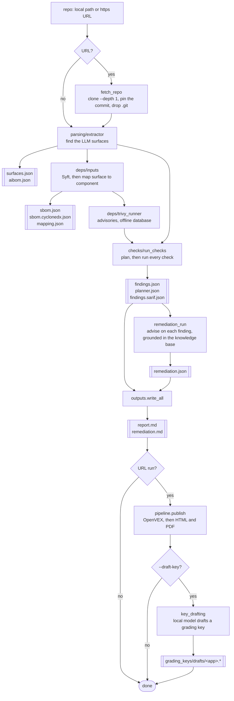
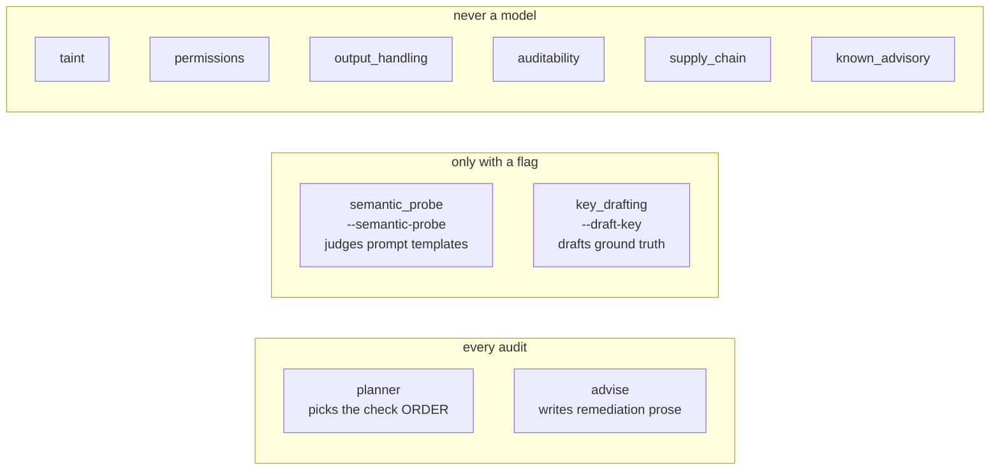
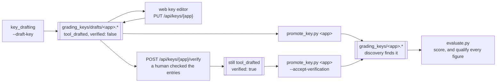

# How a run works

## One audit, end to end

A local path stops before `pipeline.publish`: **the audit itself opens no socket
and needs no renderer**. Everything after it is a separate concern, and three of
those stages are commands of their own so you can run them without re-auditing.

## Where a model is called, and where it is not

The question a reader of this project asks first. Four places, and **only two
run by default**:

**The model never decides what counts as a finding.** It may reorder the plan
and narrow which surfaces a check sees, it writes advice, and behind two flags
it judges templates and drafts a key. Every finding in `findings.json` comes
from a check in the right-hand box.

`--draft-key` is the one place a model authors *ground truth* rather than
commentary, which is why it is a flag, why the draft lands where nothing
discovers it, and why every figure such a key produces is qualified.

## A grading key, from drafted to scored against

`--draft-key` is where the flowchart above stops, and it is the *start* of this
one. Nothing discovers a draft, so nothing is scored against one until a human
moves it.

**Four things this path refuses, and each is the reason a step exists.**

*An edit may not move the key's standing.* A save cannot change `source`,
`verified`, `verified_by` or `verified_date`, because `tool_drafted` +
`verified: false`, `tool_drafted` + `verified: true` and `manual_review` +
`verified: true` are all valid documents — so a save free to move the *pair*
would pass every check there is while laundering a drafted key into one that
reads as human-authored.

*An edit may not type an anchor.* `file`, `line` and `code_anchor` are
quotations from source the browser has not read. An entry the draft never held
counts as typing one: appending a well-formed entry with a fabricated anchor
passes every downstream check, so promotion would publish ground truth quoting
a line nobody looked at.

*Verifying is not promoting, and clears one qualification.* `source` says who
**chose** the entries; `verified` says whether a human **read** them. Verifying
clears `key_unverified` and nothing else, so a verified draft still carries
`key_ai_drafted` and `key_drafted_by_scored_system` and can never read as an
independent measurement. Two of the three are closed only by a key a human
*wrote*.

*Promotion will not inherit a web claim silently.* The verify route has no
authentication, and promotion is the moment the claim starts bounding a
published figure — so a verified draft needs `--accept-verification`, which is a
local human saying they stand behind it. What that flag cannot do is leave a
trace in the key it admits: the promoted file is byte-indistinguishable from one
verified by hand-editing it, which `docs/TODO.md` records.

## The checks

Run inside a bounded LangGraph loop, one check per step, capped at
`MAX_STEPS = 20`.

| Check | Risk | Subject | Model? |
|---|---|---|---|
| `permissions` | LLM06 | tool surfaces | no |
| `taint` | LLM01 | data source → model | no |
| `output_handling` | LLM02 | `execute` calls | no |
| `auditability` | AUDITABILITY | agent constructors | no |
| `supply_chain` | LLM03 | the mapping | no |
| `known_advisory` | LLM03 | the mapping + advisories | no |
| `semantic_probe` | LLM01 | prompt templates | yes, opt-in, at the edge |

A check is named in `coverage.checks_run` only if it had something to look at.
Absent means "could not look", which the scorer reads as
`no_check_for_risk_class` — so absence is a claim, not a detail.

## The planner

Chooses the **order** checks run in, and **which surfaces** each examines. It
never chooses which checks run, and never what counts as a finding.

Five rules stop a narrowing becoming a silent claim: a check the model does not
name examines everything; an empty selection is refused; a narrowing never takes
a check below one surface; surfaces the prompt never described always run; and
the two component-anchored checks are not narrowable at all. What each check
actually examined is in `findings.json`'s `checks_narrowed`.

The model is consulted at the **edge**, in `build_findings` — never inside a
graph node, because `tests/parsing/test_offline.py` asserts the graph *attempts*
no socket, counting attempts rather than successes.

## The commands

Nine entry points. The first audits; the rest each do one thing to what an audit
produced, so none of them is on the audit path.

- `python src/main.py <repo>`: Audit; `--semantic-probe`, `--draft-key`, `--compare-models`, `--model` (name a pulled local model; `findings.json` records whichever answered, so a named one is as reproducible as the default)
- `python src/evaluate.py`: Score against `grading_keys/`
- `python src/run_baseline.py <system>`: Run a comparison baseline
- `python src/promote_key.py <app>`: Accept a corrected drafted key; `--accept-verification` when the draft claims a human checked it
- `python src/emit_vex.py <artifacts>`: OpenVEX, via vexctl
- `python src/export_reports.py <dir>`: HTML and PDF
- `python src/index_knowledge.py`: Build the advice knowledge base
- `python src/fetch_repo.py <url>`: Fetch and pin, without auditing
- `python src/model_client.py`: Check the local model answers

`python web/serve.py` is a tenth way in and deliberately not on that list: it is
a wrapper over the first command, not a command of its own, and it lives outside
`src/` because a module there may neither accept a connection nor name the
command that starts it.

## Boundaries

Each is asserted by a test, not just described here.

| Boundary | What holds it |
|---|---|
| **Four modules start a process** — `syft_runner`, `trivy_runner`, `fetch_repo`, the vexctl launcher — and each may start one named program | `test_no_write_commands.py` |
| **One of those four is now reachable from an unauthenticated GET.** `GET /api/runs/{id}/source` asks `fetch_repo.check_tree_matches_pin` whether the tree still matches its pin, which runs `git status` when the tree carries `.git` — a tool-fetched tree never does, a locally audited clone does. Bounded: `git` only, in the tree's own directory, output read and never executed. Named because "a GET only reads" is the assumption it breaks | `tests/web/test_source_pin_notes.py` |
| **Nothing under `src/` accepts a connection** — the HTTP wrapper lives in `web/`, binds loopback, and is started by hand | `test_web_containment.py` (nothing in `src/` imports `web/`), `test_web_framework_containment.py` (no `src/` module imports a server framework), `tests/web/test_server_settings.py` (the bind address, and that no CORS policy exists — it skips without the web extra) |
| **Two modules in `src/` open a connection**, as an exact set: `model_client.py` to local Ollama, and `cloud_client.py` to a hosted model, constructed only under `--compare-models` | `test_offline_containment.py` |
| **An audit attempts no socket** beyond Ollama | `test_offline.py`, counting attempts rather than successes |
| **The audited tree is never written to** | `test_no_mutation.py`, hashing it before and after |
| **The scored trees never read the scorecard** | `test_scorer_boundary.py` |
| **`src/` never imports `experiments/`** | `test_experiments_containment.py` |

The second row used to read "one module". It says two because
`--compare-models` needs a hosted client, and that is a real reduction in what
the tool guarantees — bought deliberately, and narrowed by keeping the import
inside the flag's branch so an ordinary audit never constructs it.
