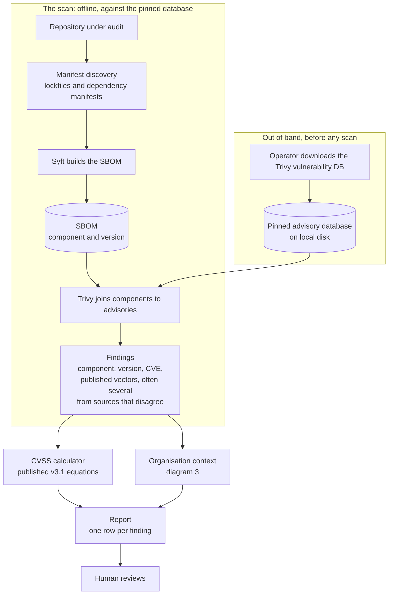
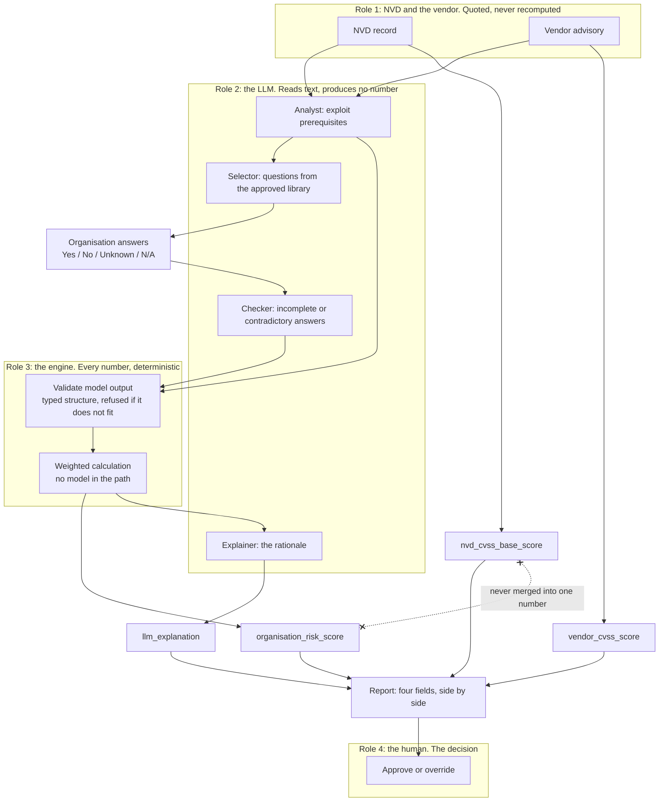
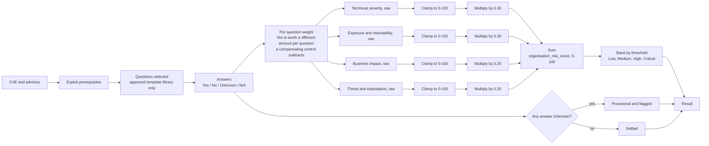
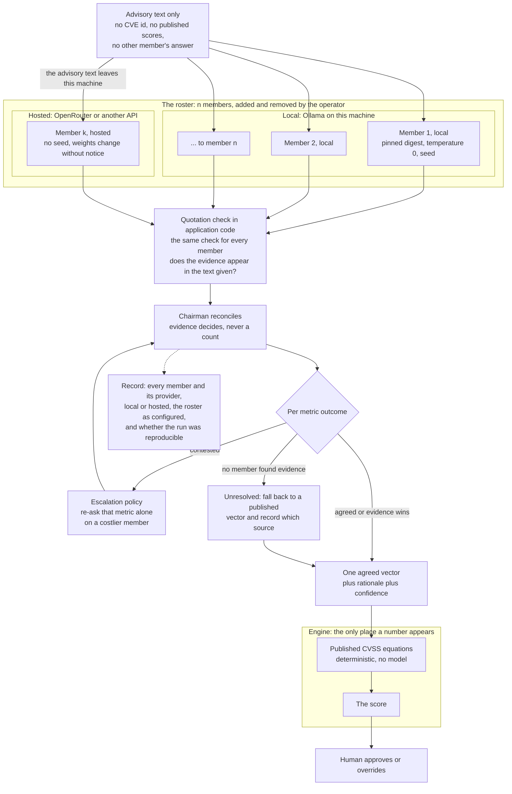
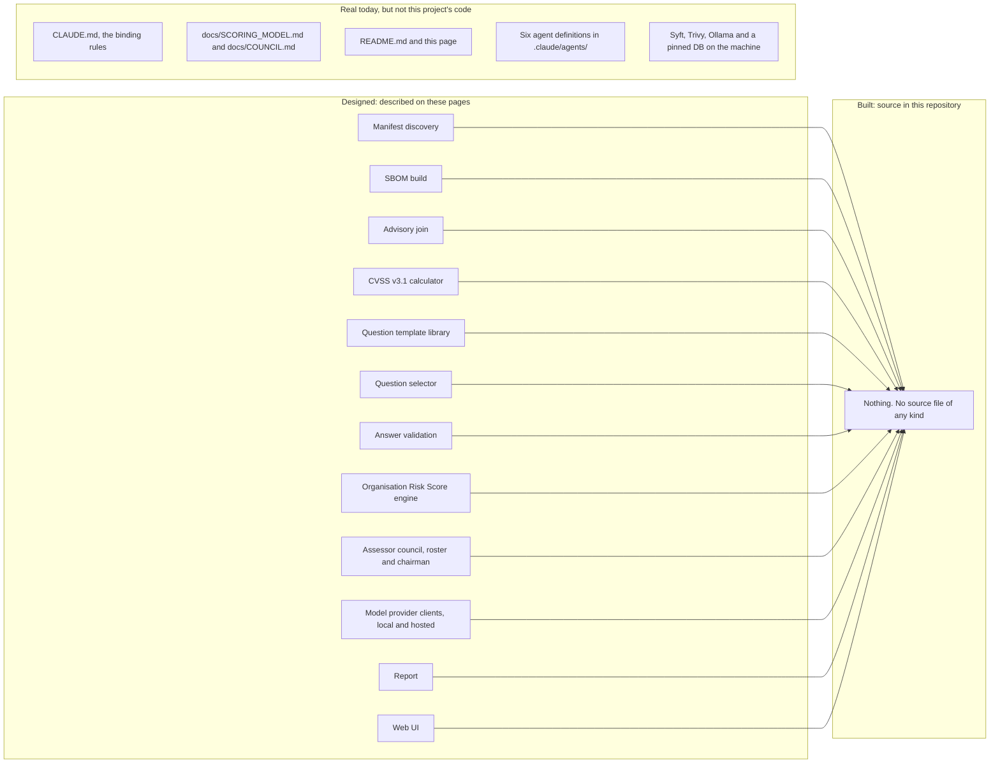

# Diagrams

The one page to read to understand the system.

**Nothing drawn here is built.** There is no `src/`, no tests, no CLI, no Python
file of any kind. Every box below is a component the project has decided to
build, not a component you can run. Diagram 5 is about nothing else.

`CLAUDE.md` rule 19 binds this file: after any change to how the system works —
a new component, a changed flow, a deleted one — **the diagrams are updated in
the same change**. A stale diagram is worse than none, because it is
confidently wrong. A change that touches no flow says so rather than skipping in
silence.

`docs/SCORING_MODEL.md` is the design and it wins over this page.
`docs/COUNCIL.md` sits inside its rules. This page draws them; it does not amend
them.

| | Diagram | Answers |
|---|---|---|
| 1 | The audit pipeline | how a repository becomes a list of findings |
| 2 | The two scores | who produces which number, and why they stay apart |
| 3 | The Organisation Risk Score | how answers become a 0–100 score and a band |
| 4 | The assessor council | how a roster of n local and hosted models settles a metric without emitting a number |
| 5 | Build status | what is designed against what exists |

## 1. The audit pipeline

**Designed, not built.**

The database is fetched out of band so that a scan runs offline against a
pinned version. That is what a reproducible scan rests on: the same commit and
the same database are meant to produce the same findings.

That choice has a cost, and it is the sharpest edge in this diagram: **an empty
or stale cache produces a clean report rather than an error.** Trivy finds no
advisories, reports nothing, and exits 0. The check on the database belongs
before the scan, not after reading the report.

What this does not show: how findings are stored, how a repeat scan is diffed
against the last one, or what the report is — file, page, or both. None of that
is decided.

## 2. The two scores

**Designed, not built.**

Four fields, four owners. The crossed dotted line is the rule the rest of the
design hangs on: **a blended number is unattributable**, so the published
severity and this environment's assessment stay in separate fields and separate
columns. A CVE that is CVSS Critical and organisation Low is the normal case.

The `validate` box is the boundary, not a formality. Model output reaches the
engine only as a typed structure that application code has already refused or
accepted. A reply that arrives unchecked is the model deciding a number by the
back door.

What this does not show: the field names are from `docs/SCORING_MODEL.md` and
no schema exists yet, so nothing here has been fixed in code.

## 3. The Organisation Risk Score

**Designed, not built.**

The clamp sits **before** the weighting, and that ordering is the whole reason
the box is drawn separately. A category full of strong controls stops at 0; an
unclamped one would go negative and buy down the other three. A control reduces
risk in its own category and no further.

The Unknown branch is a second thing the picture insists on. An Unknown answer
produces a score that is calculated and flagged. It is never silently read as
No, and the calculation is never refused.

What this does not show: the weight each individual question carries, and the
band boundaries. Those are tables in `docs/SCORING_MODEL.md`; that file also
records where the source document contradicts itself on the category weights
and why 30/25/25/20 is the one to use.

## 4. The assessor council

**Designed, not built.**

One line crosses from the roster into the engine, and it carries **a vector, not
a number**. That is the boundary made visible: everything above the engine is a
reading of text, everything numeric happens below it, and a model that emitted
7.4 directly would be unauditable. Adding members, or hosting them elsewhere,
does not move that line.

The roster is n members and the operator sets n. Local and hosted members sit
side by side, return the same fields, and meet the same quotation check. What
separates them is a boundary, not a rank: the labelled edge into the hosted box
is the advisory text leaving this machine, and that edge is opt-in per member.

Members are a panel and not a chain. Each sees the advisory text alone, so the
answers are independent and can be measured. Nothing counts them, so an even
roster raises no tie — four answers are four pieces of evidence, and the
chairman ranks them by whether the quotation verifies.

The hosted box costs reproducibility. A local member takes a seed; a hosted one
does not, and the weights behind its name change without notice. A run holding
one cannot be repeated, so the vector stops being re-derivable — while the
engine below stays deterministic, and the recorded vector still re-derives the
recorded number.

What this does not show: the shape of the roster file, which is a sketch in
`docs/COUNCIL.md` rather than a committed format, and the arithmetic of cost,
which is n × findings × metrics and is settled before a scan rather than during
it.

## 5. Build status

Every designed component converges on the same implementation, and that is the
point of the picture: twelve arrows, one destination, and the destination is
empty. The third column is there so the page is not read as claiming the
repository is bare — the rules, the design documents and the agent definitions
are written, and the third-party tools are installed. None of that is code this
project wrote.

What this does not show: an order of work. Nothing here says which component is
built first, and no such plan exists yet. The left column is also not evenly
documented — the pipeline, the scoring engine and the council have design pages
behind them, while `Report` and `Web UI` appear only as a remit in an agent
definition. The provider clients are named in `docs/COUNCIL.md` only as a
configuration sketch, and no provider has been committed to beyond Ollama.

## Keeping this page true

The check is rule 19, and it is cheap to run against a change:

| The change | This page |
|---|---|
| a new component, or one deleted | the diagram it appears in, same change |
| a flow that now runs in a different order | the diagram it appears in, same change |
| the first source file lands | diagram 5 stops saying nothing |
| prose, tests, or a rename with no flow change | unchanged, and the report says so |
