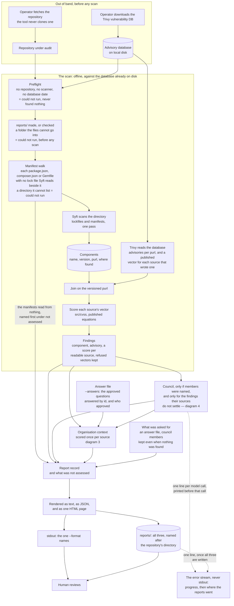
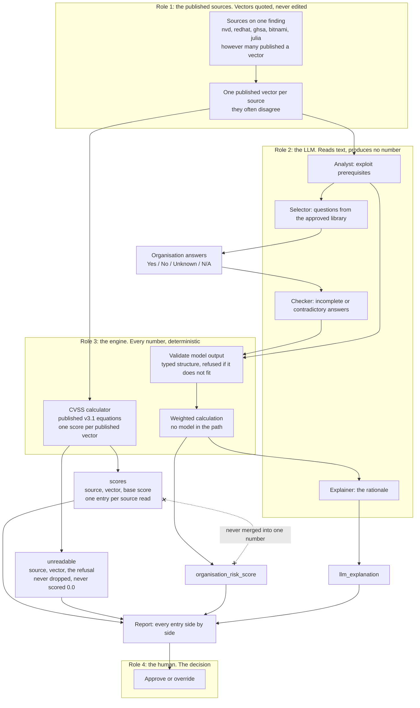
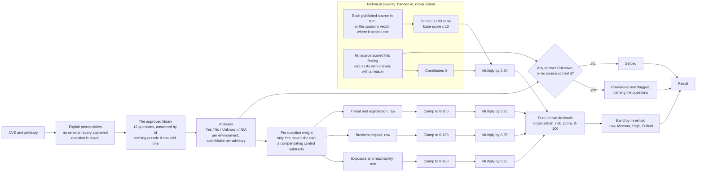
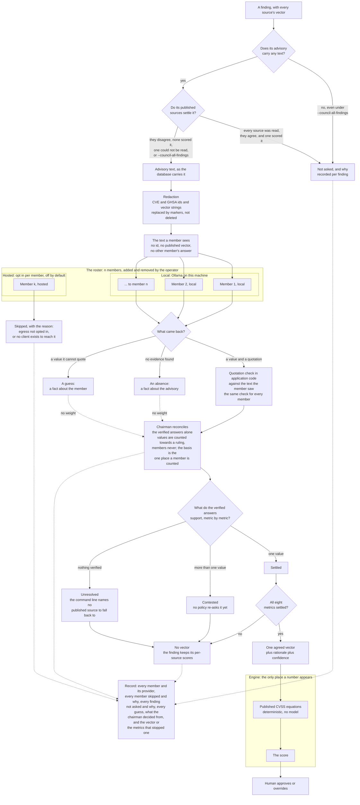
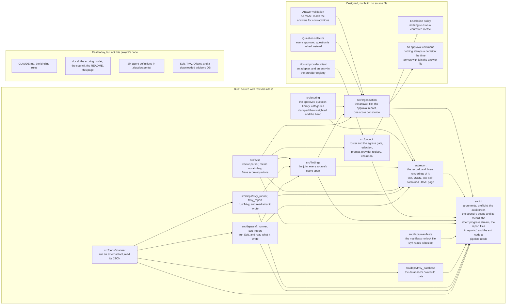

# Diagrams

The one page to read to understand the system.

**It runs end to end.** A repository on disk becomes a report — components
catalogued, advisories joined, every source's published vector scored and kept
attributed, a council of local models asked if the operator names one, and every
finding weighed against this environment into an Organisation Risk Score if the
operator answers the approved questions. What is optional is named as absent in
the record rather than left out or printed as a zero. Each diagram states its
own boundary, and diagram 5 is about nothing else.

`CLAUDE.md` rule 19 binds this file: after any change to how the system works —
a new component, a changed flow, a deleted one — **the diagrams are updated in
the same change**. A stale diagram is worse than none, because it is
confidently wrong. A change that touches no flow says so rather than skipping in
silence.

`docs/SCORING_MODEL.md` is the design and it wins over this page.
`docs/COUNCIL.md` sits inside its rules. This page draws them; it does not amend
them.

| | Diagram | Answers |
|---|---|---|
| 1 | The audit pipeline | how a repository on disk becomes a report |
| 2 | The published scores | how many published scores a finding carries, and why they never merge |
| 3 | The Organisation Risk Score | how answers become a 0–100 score and a band |
| 4 | The assessor council | how a roster of n local and hosted models settles a metric without emitting a number |
| 5 | Build status | what is designed against what exists |

## 1. The audit pipeline

**Built, and it runs.** `audit <repository>` walks this path, all of it, given
an answer file and council members.

The database is fetched out of band so that a scan runs offline against the copy
already on disk, and the repository is fetched out of band for the same reason:
fetching needs the corporate proxy on and scanning needs it off, so a command
doing both would flip that state mid-run. What is left is repeatable — the same
commit and the same database produce the same findings, as many times as anyone
wants.

That choice had a cost and the preflight is what pays it: **an empty or stale
cache produces a clean report rather than an error.** Trivy finds no advisories,
reports nothing, and exits 0. So the database is asked for its own build date
before anything is scanned, and a run that cannot read one does not start. Every
refusal there is "could not run", which a pipeline must be able to tell from
"found nothing" — conflating the two is how a broken scan goes green.

The manifest walk exists for the same reason. Syft reads a `package.json`,
`composer.json` or `Gemfile` through the lock file beside it and through nothing
else, so one with no lock file yields no package, and `0 findings` over it reads
like a clean repository. The walk names each one, and the record lists it first
under not assessed with a line in the summary saying the counts leave it out;
a directory it cannot list is "could not run" rather than passed over.

Unlike those refusals, an unread manifest does not move the exit code: the run
still exits by what it found, so a pipeline reading only the code goes green,
and has to read `not_assessed` in the JSON to see it. What counts as read was
measured against Syft 1.52, and `README.md` names the four ways the walk falls
short.

Syft is one box because it is one call: it finds the manifests and catalogues
them in the same pass; the walk before it feeds it nothing. The
calculator sits inside the scan because that is where it runs — every source's
vector is parsed and scored as the finding is assembled, not in a pass over the
findings afterwards.

Two of the three inputs are optional, and the record says so when they are
absent. Without `--answers` nobody has been asked about the environment, so
there is no Organisation Risk Score and the report names the absence rather than
printing a zero — a number there would read as a finding assessed and found
harmless. Without `--council-member` no model has read anything, and the
per-source scores stand side by side with no winner.

The record also keeps what was asked for, because an absent score or ruling has
two causes. With `--answers` or `--council-member` and nothing found, there is
still no score and no ruling, and the reason says there was no finding to weigh
or to put, rather than that nobody asked.

The council feeds the context as well as the record, and that edge is the whole
argument of this project in one line: where a council settled a vector there is
one technical severity and the finding takes one score, and everywhere else it
is scored once per published source, because choosing a source is precedence
`docs/SCORING_MODEL.md` refuses to set.

One record, three renderings, all of them saved. Every run renders text for a
terminal, JSON for the audit artefact, and one self-contained HTML page that
fetches nothing, and writes all three into `reports/` in the directory it ran
from. `--format` only picks the one printed on stdout, and that file is byte for
byte the same. All three read the same record and none of them works a number
out, so a figure cannot differ between them.

`reports/` appears twice, before the scan and after it. A council run is long,
so a folder that cannot take the files refuses the run before Syft starts
rather than after the last model call. A write that still fails afterwards
leaves the record on stdout and exits "could not run", because the run did not
do all it was asked.

The files are named after the repository's directory and never after the time,
since `src/` reads no clock. That costs history: a second run of the same
repository overwrites the first's three files, and two repositories with the
same directory name overwrite each other's.

The dotted lines are the only thing a run writes outside that record, and they
go to the error stream because stdout belongs to `--format json`: a council run
says it is alive, and a run says where its files went, without the piped
artefact gaining a byte. Each progress line carries counts and no elapsed time,
and prints *before* the call it names, so a slow member is a line that sits
there and the reader supplies the seconds. What that costs is an exact figure —
the transcript afterwards cannot tell ninety seconds from nine minutes — and
what it buys is that `src/` reads no clock, which is what keeps two runs of the
same commit byte-identical.

What this does not show: how a repeat scan is diffed against the last one, which
is not decided and not built. A repeat overwrites the last one's files, so
nothing in `reports/` is kept to diff against.

## 2. The published scores

**Built, apart from the LLM column.** The published vectors, the calculator, the
weighted calculation and the report are real, and `organisation_risk_score` is
produced once per source when an operator answers. What is missing is every role
in the middle: no analyst, no selector, no checker, no explainer, so
`llm_explanation` is reported as not assessed.

One entry per source, plus the two fields this system owns. The crossed dotted
line is the rule the rest of the design hangs on: **a blended number is
unattributable**, so the published severities and this environment's assessment
stay in separate fields and separate columns. A CVE that is CVSS Critical and
organisation Low is the normal case.

The left column is a list, not a pair. A finding is assessed by however many
sources published a vector for it — three or more on 87% of one measured corpus
— and no source is the reference the others are compared against. On one real
repository NVD had a vector for 4 findings of 18 while GHSA had all 18.
`docs/SCORING_MODEL.md` carries the counts.

Each entry's score is computed from that entry's vector, never quoted. The
vector is what the source published; the number beside it is what the v3.1
equations give, so a reader can re-derive every one of them.

The `validate` box is the boundary, not a formality. Model output reaches the
engine only as a typed structure that application code has already refused or
accepted. A reply that arrives unchecked is the model deciding a number by the
back door.

What this does not show: which source wins when they disagree, because nothing
ranks them — that is the council in diagram 4. The field names are from
`docs/SCORING_MODEL.md`, which this page draws and does not amend.

## 3. The Organisation Risk Score

**Built, and called.** `src/scoring/` is everything from the answers rightwards,
including the approved library the questions come from. `src/organisation/`
reads the answer file and puts each finding through this diagram once per
published source.

The clamp sits **before** the weighting, and that ordering is the whole reason
the box is drawn separately. A category full of strong controls stops at 0; an
unclamped one would go negative and buy down the other three. A control reduces
risk in its own category and no further.

**Technical severity has no question path**, and the missing arrow is the point.
The other three categories are asked; this one is handed in, as a number with
the source it came from. The engine refuses an unattributed number outright,
because that is the merge the design forbids arriving by the back door.

So a finding with three disagreeing sources goes through this diagram three
times and comes out as a range. That is not indecision: it answers a question
nothing else here can, which is whether believing `nvd` rather than `ghsa`
changes what this organisation should do. Often it does not — and a report that
picked one source would have hidden both the cases where it matters and the
cases where it stops mattering.

The provisional branch has **two ways in**, not one. An Unknown answer is the
first. A finding nobody scored is the second: it contributes 0 to the weighted
sum, which is arithmetic and not a judgement that the flaw is harmless, and it
flags the whole score the same way an Unknown answer does. Neither is ever read
as No, and neither refuses the calculation.

What this does not show: the weight each individual question carries, and the
band boundaries. Those are tables in `docs/SCORING_MODEL.md`; that file also
records where the source document contradicts itself on the category weights
and why 30/25/25/20 is the one to use.

## 4. The assessor council

**Built, except the hosted client.** `src/council/` is the roster and its gate,
the redaction, the prompt, the local Ollama client, the quotation check, the
chairman and the runner; `src/cvss` is the engine below. Nothing reaches a
hosted member, and no escalation policy re-asks a contested metric.

**The council is scoped before it is a council.** It reconciles sources, so a
finding whose sources already agree is not its work. On the audited repository
13 of 18 findings are undisputed, so a two-member run makes 80 calls where
`--council-all-findings` makes 288; runs of both kinds are kept in
`measurements/council_runs/`. A finding **no** source scored takes the other
branch, and so does one carrying a source the calculator could not read: in
neither case has anyone checked that the sources agree, and for the first a
council vector is the only severity it will ever carry. `--council-all-findings`
sends every finding with text down that branch, which is the only way to
discover that two agreeing sources are both wrong. A finding whose advisory has
no text is passed over even then, because there is nothing for a member to
read.

**Most findings end with no vector, and the diagram draws why.** A vector needs
all eight metrics. A contested metric has two verified values and no winner, and
an unresolved one could only take a value from a published source — which the
command line refuses to choose, since choosing is the precedence
`docs/SCORING_MODEL.md` leaves open. So one unsettled metric means no vector,
the run is still recorded with what it could not settle, and the finding keeps
its per-source scores side by side. In the two Qwen–Gemma runs kept, no
finding reached a vector: 0 of 5, and 0 of 18. With `llama3.2:latest` in
Gemma's place, 1 of 5 and 4 of 18 did, and `measurements/README.md` says why
that is not better reading.

The `Not asked` box reaches the record for the same reason the `Skipped` one
does. A finding the council was passed over, a finding it assessed and could not
settle, and a run where nobody was named to ask are three different facts, and a
scoped run that recorded nothing for what it skipped would report the first as
the third. A run that named members and found nothing is a fourth, and the
record keeps it apart from the third by keeping whether any were named.

One line crosses from the roster into the engine, and it carries **a vector, not
a number**. That is the boundary made visible: everything above the engine is a
reading of text, everything numeric happens below it, and a model that emitted
7.4 directly would be unauditable. Adding members, or hosting them elsewhere,
does not move that line.

**No edge reaches the hosted box, and that is the state of the code rather than
a rule.** Two independent things stop the text: `egress` is off unless the
operator opts the member in, and no client exists to reach a hosted model even
when they do. The gate is built and tested; what it guards is not. The day an
OpenRouter client lands, one of those two reasons disappears and `egress`
becomes the only thing between an advisory and the network — which is worth
knowing before that day, not after.

Redaction is a step, not a request. The ids and vector strings are taken out of
the text before any member sees it, because a sentence in a prompt cannot make a
model unsee `CVE-2021-44228`. The same redacted text is what the quotation check
reads: checking against the original would fail every quotation spanning a
marker and report an absence the advisory never had.

The box says **vector** rather than score, and the distinction is measured. One
advisory of 1,187 publishes a score in prose beside the redacted vector, and
three words later publishes the disputed metric's value in words as well. No
pattern takes that out without taking the advisory's reasoning with it, so it is
a known gap rather than a closed one — `docs/COUNCIL.md` carries the example.

Three replies, three shapes, and only one of them can decide anything. A value
with a quotation goes to the check; an absence and a guess are recorded and
weigh nothing. They are kept apart because an absence is a fact about the
advisory and a guess is a fact about the member — and a model asked about a
metric its text is silent on tends to guess rather than decline, so the two get
mixed by any design that folds them together.

Members are a panel and not a chain. Each sees the advisory text alone, so the
answers are independent and can be measured. Nothing counts them towards a
ruling, so an even roster raises no tie — four answers are four pieces of
evidence. The chairman keeps the ones whose quotation verifies and asks whether
they point at one value or several; unanimity with nothing verified settles
nothing.

**The chairman is not a member and makes no model call.** `src/council/chairman.py`
is ordinary code: it filters the answers by whether the quotation is in the text,
then counts distinct values. `docs/COUNCIL.md` explains why it has to be — every
rule it applies is mechanical, and a model in that seat would turn an auditable
fact into a sentence nobody can check.

The record box sits outside `src/council/` in the code, and so does the scope
decision at the top: `src/cli/council_run.py` chooses which findings to put to a
council and `src/cli/council_detail.py` turns a run into the record, because
`src/report` does not import the council and the command line is the one place
allowed to see both a council run and the record.

The hosted box will cost reproducibility. A local member takes a pinned model; a
hosted one takes no seed, and the weights behind its name change without notice.
A run holding one could not be repeated, so the vector would stop being
re-derivable — while the engine below stays deterministic, and the recorded
vector still re-derives the recorded number.

What this does not show: the shape of the roster file, which is a sketch in
`docs/COUNCIL.md` rather than a committed format; and the arithmetic of cost,
which is n × the findings the scope leaves × metrics and is settled before a
scan. What puts an advisory to the council is now the left-hand branch above,
where nothing did before.

## 5. Build status

**There is no island left.** `src/scoring` was the last box on this page with no
arrow in and none out; `src/organisation` imports it, and the path from a
repository on disk to a banded risk score is closed. Every component the design
named as load-bearing is now reachable from the command line.

Every arrow in the built column is a real import, read off the source with
`grep` rather than off the design, **and every real one is drawn** — so a missing
arrow here means a missing import, not an omission. Two absences are worth
naming because they are deliberate: nothing runs from `src/council` to
`src/report`, since the command line holds both and `src/cli/council_detail.py`
turns one into the other, and nothing runs from `src/findings` to `src/scoring`,
because `src/organisation` stands between them and is the only place that decides
which technical severity a score is computed from — once per published source, or
once from the council's vector where it settled one.

The `src/scoring` to `src/report` arrow is three names in two modules.
`src/report/html_answers.py` imports the `Answer` enum, to mark an Unknown, and
`RiskScore`, the type whose weights it prints; `src/report/json_risk.py`
imports `Category`, to find one category's weight by name. All three are the
vocabulary the record is written in, not a figure the engine works out. Every
number the report shows comes off the record, so there is no second place a
score could be derived and differ.

What remains in the middle column is smaller than it looks and none of it blocks
a run. Two are refinements of things that work: a selector would ask fewer
questions than all twelve, and answer validation would read the answers for
contradictions. Two are the council's: a hosted client, and an escalation policy
for a contested metric. The fifth is the only one that changes what a record can
claim — nothing stamps an approval, because the time arrives with the human act
in the answer file rather than from a clock, and there is no clock anywhere in
`src/`. An approval command would be the first one.

The council is still built **except** for a piece of itself: its local client
works and its `egress` gate is enforced, and the hosted client that gate exists
to guard does not exist. That is why the hosted provider client keeps a box of
its own with an edge back into the registry it would be registered in.

**The web page left the middle column.** The `src/report/html_*.py` modules
render the record as one HTML file with the stylesheet inlined and no script, no
font and no link out, because the page is produced behind a proxy and opened
from disk. What that is not is a web application: nothing is served, nothing is
interactive, and there is no build step and no JavaScript — which is the whole of
`frontend-developer`'s remit, and none of it is written. The box is gone because
a reader can open the report in a browser today, not because that remit is met.

The third column is there so the page is not read as claiming the rest is
absent: the rules, the design documents and the agent definitions are written,
and the third-party tools are installed. None of that is code this project
wrote.

What this does not show: an order of work for the middle column, because no such
plan exists. That column is also not evenly documented — the escalation policy
and the hosted client are described in `docs/COUNCIL.md`, the selector and the
answer validation in `docs/SCORING_MODEL.md`, and the approval command only as a
note there on where an approval's time comes from.

## Keeping this page true

The check is rule 19, and it is cheap to run against a change:

| The change | This page |
|---|---|
| a new component, or one deleted | the diagram it appears in, same change |
| a flow that now runs in a different order | the diagram it appears in, same change |
| a component moves from designed to built | diagram 5 moves it, same change |
| prose, tests, or a rename with no flow change | unchanged, and the report says so |
