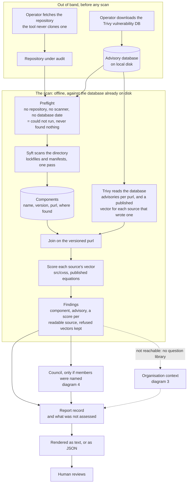
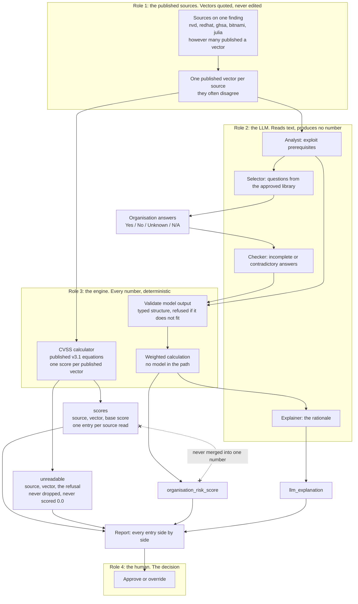
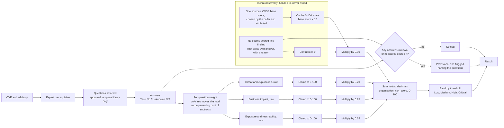
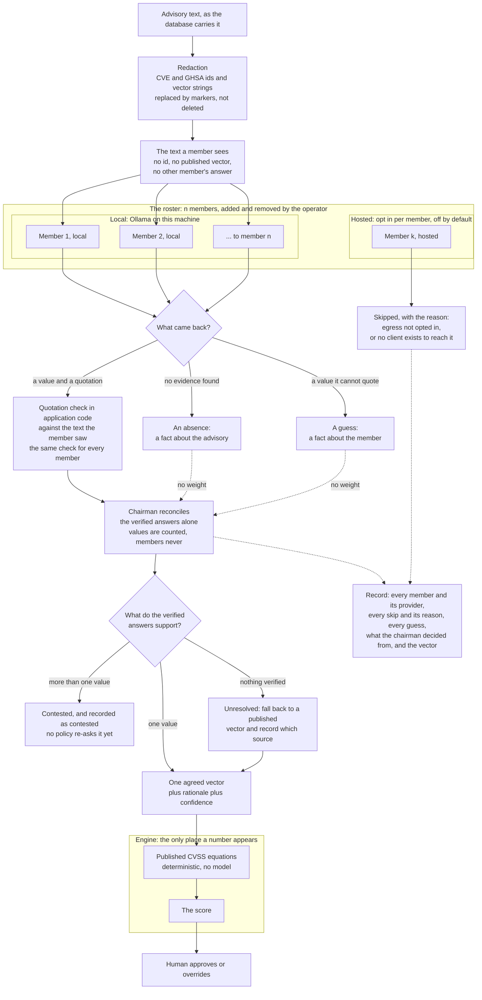
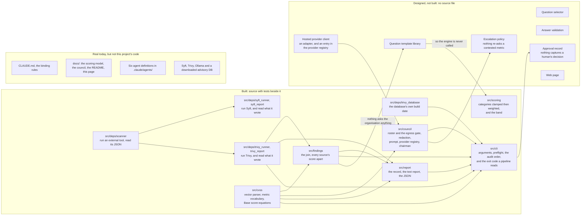

# Diagrams

The one page to read to understand the system.

**The scan path runs end to end; the risk score does not.** A repository on disk
becomes a report — components catalogued, advisories joined, every source's
published vector scored and kept attributed, and a council of local models asked
if the operator names one. The Organisation Risk Score is built and unreachable:
no approved question library exists, so nobody answers anything and the report
names the absence rather than printing a zero. Each diagram states its own
boundary, and diagram 5 is about nothing else.

`CLAUDE.md` rule 19 binds this file: after any change to how the system works —
a new component, a changed flow, a deleted one — **the diagrams are updated in
the same change**. A stale diagram is worse than none, because it is
confidently wrong. A change that touches no flow says so rather than skipping in
silence.

`docs/SCORING_MODEL.md` is the design and it wins over this page.
`docs/COUNCIL.md` sits inside its rules. This page draws them; it does not amend
them.

| | Diagram | Answers |
|---|---|---|
| 1 | The audit pipeline | how a repository on disk becomes a report |
| 2 | The published scores | how many published scores a finding carries, and why they never merge |
| 3 | The Organisation Risk Score | how answers become a 0–100 score and a band |
| 4 | The assessor council | how a roster of n local and hosted models settles a metric without emitting a number |
| 5 | Build status | what is designed against what exists |

## 1. The audit pipeline

**Built, and it runs.** `PYTHONPATH=src python -m cli.main <repository>` walks
this path. The one branch it does not walk is the organisation context, because
no question library exists to feed it.

The database is fetched out of band so that a scan runs offline against the copy
already on disk, and the repository is fetched out of band for the same reason:
fetching needs the corporate proxy on and scanning needs it off, so a command
doing both would flip that state mid-run. What is left is repeatable — the same
commit and the same database produce the same findings, as many times as anyone
wants.

That choice had a cost and the preflight is what pays it: **an empty or stale
cache produces a clean report rather than an error.** Trivy finds no advisories,
reports nothing, and exits 0. So the database is asked for its own build date
before anything is scanned, and a run that cannot read one does not start. Every
refusal there is "could not run", which a pipeline must be able to tell from
"found nothing" — conflating the two is how a broken scan goes green.

Syft is one box because it is one call: it finds the manifests and catalogues
them in the same pass, so there is no separate discovery component. The
calculator sits inside the scan because that is where it runs — every source's
vector is parsed and scored as the finding is assembled, not in a pass over the
findings afterwards.

The two dotted edges are the part that does not run. The engine that turns
answers about an environment into an Organisation Risk Score is built; the
approved question library that would produce those answers is not, so no
organisation answers anything and the record carries the absence rather than a
zero. A report that looked complete would be worse than one that says what it
did not do.

What this does not show: how a repeat scan is diffed against the last one, which
is not decided and not built.

## 2. The published scores

**The left half runs.** The published vectors, the calculator behind them and
the report are real. No LLM role exists and nothing validates model output, so
`organisation_risk_score` and `llm_explanation` are reported as not assessed —
the weighted calculation itself is built, in `src/scoring`, and never called.

One entry per source, plus the two fields this system owns. The crossed dotted
line is the rule the rest of the design hangs on: **a blended number is
unattributable**, so the published severities and this environment's assessment
stay in separate fields and separate columns. A CVE that is CVSS Critical and
organisation Low is the normal case.

The left column is a list, not a pair. A finding is assessed by however many
sources published a vector for it — three or more on 87% of one measured corpus
— and no source is the reference the others are compared against. On one real
repository NVD had a vector for 4 findings of 18 while GHSA had all 18.
`docs/SCORING_MODEL.md` carries the counts.

Each entry's score is computed from that entry's vector, never quoted. The
vector is what the source published; the number beside it is what the v3.1
equations give, so a reader can re-derive every one of them.

The `validate` box is the boundary, not a formality. Model output reaches the
engine only as a typed structure that application code has already refused or
accepted. A reply that arrives unchecked is the model deciding a number by the
back door.

What this does not show: which source wins when they disagree, because nothing
ranks them — that is the council in diagram 4. The field names are from
`docs/SCORING_MODEL.md`, which this page draws and does not amend.

## 3. The Organisation Risk Score

**Built, apart from the questions — and therefore never called.** `src/scoring/`
is everything from the answers rightwards. The template library and the selector
that would produce those answers are not built, and no module imports
`src/scoring`, so nothing in a run reaches this diagram.

The clamp sits **before** the weighting, and that ordering is the whole reason
the box is drawn separately. A category full of strong controls stops at 0; an
unclamped one would go negative and buy down the other three. A control reduces
risk in its own category and no further.

**Technical severity has no question path**, and the missing arrow is the point.
The other three categories are asked; this one is handed in, as a number with
the source it came from. Choosing which source's CVSS score to use is the
council's job and the council does not exist, so the engine refuses to reach
into a finding and pick one — and it refuses an unattributed number outright,
because that is the merge the design forbids arriving by the back door.

The provisional branch has **two ways in**, not one. An Unknown answer is the
first. A finding nobody scored is the second: it contributes 0 to the weighted
sum, which is arithmetic and not a judgement that the flaw is harmless, and it
flags the whole score the same way an Unknown answer does. Neither is ever read
as No, and neither refuses the calculation.

What this does not show: the weight each individual question carries, and the
band boundaries. Those are tables in `docs/SCORING_MODEL.md`; that file also
records where the source document contradicts itself on the category weights
and why 30/25/25/20 is the one to use.

## 4. The assessor council

**Built, except the hosted client.** `src/council/` is the roster and its gate,
the redaction, the prompt, the local Ollama client, the quotation check, the
chairman and the runner; `src/cvss` is the engine below. Nothing reaches a
hosted member, and no escalation policy re-asks a contested metric.

One line crosses from the roster into the engine, and it carries **a vector, not
a number**. That is the boundary made visible: everything above the engine is a
reading of text, everything numeric happens below it, and a model that emitted
7.4 directly would be unauditable. Adding members, or hosting them elsewhere,
does not move that line.

**No edge reaches the hosted box, and that is the state of the code rather than
a rule.** Two independent things stop the text: `egress` is off unless the
operator opts the member in, and no client exists to reach a hosted model even
when they do. The gate is built and tested; what it guards is not. The day an
OpenRouter client lands, one of those two reasons disappears and `egress`
becomes the only thing between an advisory and the network — which is worth
knowing before that day, not after.

Redaction is a step, not a request. The ids and vector strings are taken out of
the text before any member sees it, because a sentence in a prompt cannot make a
model unsee `CVE-2021-44228`. The same redacted text is what the quotation check
reads: checking against the original would fail every quotation spanning a
marker and report an absence the advisory never had.

The box says **vector** rather than score, and the distinction is measured. One
advisory of 1,187 publishes a score in prose beside the redacted vector, and
three words later publishes the disputed metric's value in words as well. No
pattern takes that out without taking the advisory's reasoning with it, so it is
a known gap rather than a closed one — `docs/COUNCIL.md` carries the example.

Three replies, three shapes, and only one of them can decide anything. A value
with a quotation goes to the check; an absence and a guess are recorded and
weigh nothing. They are kept apart because an absence is a fact about the
advisory and a guess is a fact about the member — and a model asked about a
metric its text is silent on tends to guess rather than decline, so the two get
mixed by any design that folds them together.

Members are a panel and not a chain. Each sees the advisory text alone, so the
answers are independent and can be measured. Nothing counts them, so an even
roster raises no tie — four answers are four pieces of evidence. The chairman
keeps the ones whose quotation verifies and asks whether they point at one value
or several; unanimity with nothing verified settles nothing.

The hosted box will cost reproducibility. A local member takes a pinned model; a
hosted one takes no seed, and the weights behind its name change without notice.
A run holding one could not be repeated, so the vector would stop being
re-derivable — while the engine below stays deterministic, and the recorded
vector still re-derives the recorded number.

What this does not show: the shape of the roster file, which is a sketch in
`docs/COUNCIL.md` rather than a committed format; the arithmetic of cost, which
is n × findings × metrics and is settled before a scan; and what puts an advisory
to the council in the first place, because nothing does yet.

## 5. Build status

**One path runs, and one island is left.** `src/cli` reaches five packages and
closes the line from a repository on disk to a report: that is the frontier this
page has drawn open in both directions since the first diagram, shut on one
side. What it does not reach is `src/scoring`. The engine has no arrow into it
and none out, because nothing imports it — the questions that would give it
something to weigh are the one component between a finding and a risk score, and
they are in the middle column.

Every arrow in the built column is a real import, read off the source rather
than off the design. `src/cli` is the only module that imports across packages
in quantity, which is what an entry point looks like; before it existed the
three built stretches shared nothing but `src/cvss`. No arrow runs from
`src/council` to `src/report` — the command line holds both and hands one to the
other — and none runs from `src/findings` to `src/scoring`, because which
source's CVSS score becomes the technical severity is still the council's call
and nothing makes it.

The council is still built **except** for a piece of itself: its local client
works and its `egress` gate is enforced, and the hosted client that gate exists
to guard does not exist. That is why the hosted provider client keeps a box of
its own with an edge back into the registry it would be registered in.

The third column is there so the page is not read as claiming the rest is
absent: the rules, the design documents and the agent definitions are written,
and the third-party tools are installed. None of that is code this project
wrote.

What this does not show: an order of work for the middle column, because no such
plan exists. That column is also not evenly documented — the escalation policy
and the hosted client are described in `docs/COUNCIL.md`, the question library
only as a constraint in `docs/SCORING_MODEL.md`, and the web page only as a
remit in an agent definition.

## Keeping this page true

The check is rule 19, and it is cheap to run against a change:

| The change | This page |
|---|---|
| a new component, or one deleted | the diagram it appears in, same change |
| a flow that now runs in a different order | the diagram it appears in, same change |
| a component moves from designed to built | diagram 5 moves it, same change |
| prose, tests, or a rename with no flow change | unchanged, and the report says so |
