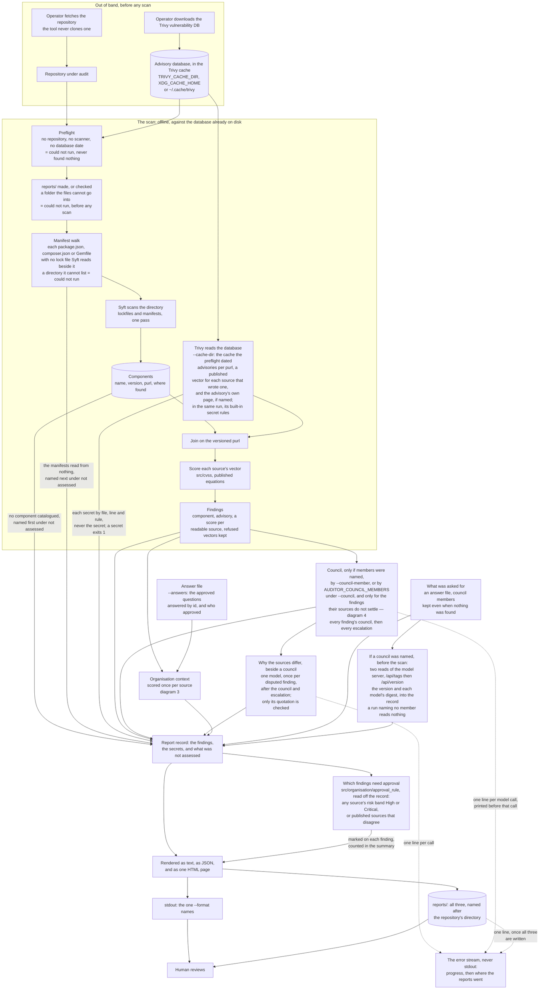
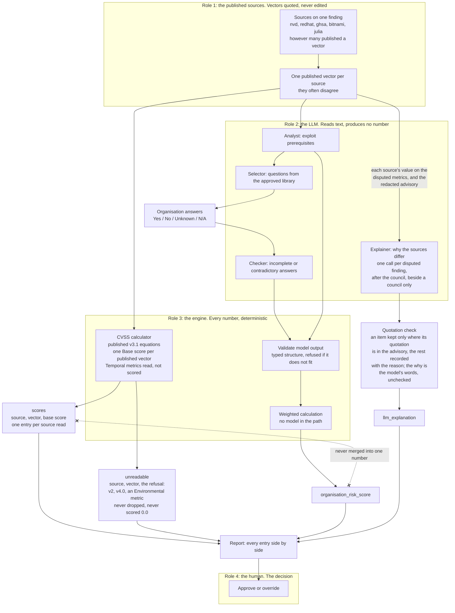
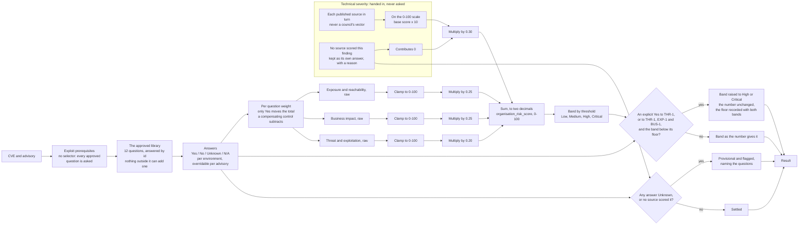
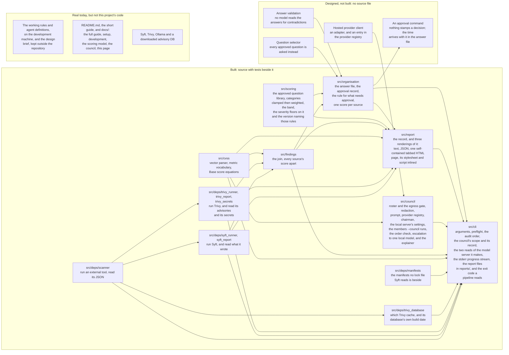

# Diagrams

The one page to read to understand the system.

**It runs end to end.** A repository on disk becomes a report — components
catalogued, advisories joined, every source's published vector scored and kept
attributed, a council of local models asked if the operator names one, and every
finding weighed against this environment into an Organisation Risk Score if the
operator answers the approved questions. What is optional is named as absent in
the record rather than left out or printed as a zero. Each diagram states its
own boundary, and diagram 5 is about nothing else.

The project binds this file to one rule: after any change to how the system
works — a new component, a changed flow, a deleted one — **the diagrams are
updated in the same change**. A stale diagram is worse than none, because it is
confidently wrong. A change that touches no flow says so rather than skipping in
silence.

`docs/SCORING_MODEL.md` is the design and it wins over this page.
`docs/COUNCIL.md` sits inside its rules. This page draws them; it does not amend
them.

| | Diagram | Answers |
|---|---|---|
| 1 | The audit pipeline | how a repository on disk becomes a report |
| 2 | The published scores | how many published scores a finding carries, and why they never merge |
| 3 | The Organisation Risk Score | how answers become a 0–100 score and a band |
| 4 | The assessor council | how a roster of n local and hosted models settles a metric without emitting a number |
| 5 | Build status | what is designed against what exists |

## 1. The audit pipeline

**Built, and it runs.** `audit <repository>` walks this path, all of it, given
an answer file and council members.

```mermaid
flowchart TD
    subgraph OOB["Out of band, before any scan"]
        fetch["Operator downloads the Trivy vulnerability DB"] --> adb[("Advisory database, in the Trivy cache<br/>TRIVY_CACHE_DIR, XDG_CACHE_HOME<br/>or ~/.cache/trivy")]
        get["Operator fetches the repository<br/>the tool never clones one"] --> repo["Repository under audit"]
    end

    subgraph SCAN["The scan: offline, against the database already on disk"]
        pre["Preflight<br/>no repository, no scanner, no database date<br/>= could not run, never found nothing"]
        repo --> pre
        pre --> rdir["reports/ made, or checked<br/>a folder the files cannot go into<br/>= could not run, before any scan"]
        rdir --> walk["Manifest walk<br/>each package.json, composer.json or Gemfile<br/>with no lock file Syft reads beside it<br/>a directory it cannot list = could not run"]
        walk --> syft["Syft scans the directory<br/>lockfiles and manifests, one pass"]
        syft --> comp[("Components<br/>name, version, purl, where found")]
        trivy["Trivy reads the database<br/>--cache-dir: the cache the preflight dated<br/>advisories per purl, a published<br/>vector for each source that wrote one,<br/>and the advisory's own page, if named;<br/>in the same run, its built-in secret rules"]
        comp --> join["Join on the versioned purl"]
        trivy --> join
        join --> asm["Score each source's vector<br/>src/cvss, published equations"]
        asm --> fin["Findings<br/>component, advisory, a score per<br/>readable source, refused vectors kept"]
    end

    adb --> pre
    adb --> trivy
    comp -->|"no component catalogued,<br/>named first under not assessed"| rec
    walk -->|"the manifests read from nothing,<br/>named next under not assessed"| rec
    trivy -->|"each secret by file, line and rule,<br/>never the secret; a secret exits 1"| rec

    fin --> cou["Council, only if members were named,<br/>by --council-member, or by AUDITOR_COUNCIL_MEMBERS<br/>under --council, and only for the findings<br/>their sources do not settle — diagram 4<br/>every finding's council, then every escalation"]
    fin --> ctx["Organisation context<br/>scored once per source<br/>diagram 3"]
    ans["Answer file<br/>--answers: the approved questions<br/>answered by id, and who approved"] --> ctx
    fin --> rec["Report record: the findings,<br/>the secrets, and what was not assessed"]
    cou --> rec
    cou --> expl["Why the sources differ, beside a council<br/>one model, once per disputed finding,<br/>after the council and escalation;<br/>only its quotation is checked"]
    expl --> rec
    expl -. "one line per call" .-> err
    ctx --> rec
    asked["What was asked for<br/>an answer file, council members<br/>kept even when nothing was found"] --> rec
    asked --> ident["If a council was named, before the scan:<br/>two reads of the model server, /api/tags then /api/version<br/>the version and each model's digest, into the record<br/>a run naming no member reads nothing"]
    ident --> rec
    rec --> rnd["Rendered as text, as JSON,<br/>and as one HTML page"]
    rec --> apr["Which findings need approval<br/>src/organisation/approval_rule, read off the record:<br/>any source's risk band High or Critical,<br/>or published sources that disagree"]
    apr -->|"marked on each finding,<br/>counted in the summary"| rnd
    rnd --> out["stdout: the one --format names"]
    rnd --> saved[("reports/: all three, named after<br/>the repository's directory")]
    out --> hum["Human reviews"]
    saved --> hum
    cou -. "one line per model call,<br/>printed before that call" .-> err["The error stream, never stdout:<br/>progress, then where the reports went"]
    saved -. "one line, once all three<br/>are written" .-> err
```

The database is fetched out of band so that a scan runs offline against the copy
already on disk, and the repository is fetched out of band for the same reason:
fetching needs the corporate proxy on and scanning needs it off, so a command
doing both would flip that state mid-run. What is left is repeatable — the same
commit and the same database produce the same findings, as many times as anyone
wants.

That choice had a cost and the preflight is what pays it: **an empty cache
produces a clean report rather than an error.** Trivy finds no advisories,
reports nothing, and exits 0. So the database is asked for its own build date
before anything is scanned, and a run that cannot read one does not start; a
stale one is not refused, and its date is in every report. The cache that date
is read from is found once, from the same variables Trivy reads, and handed to
the scan as `--cache-dir`, so the database dated is the database scanned. Every
refusal there is "could not run", which a pipeline must be able to tell from
"found nothing" — conflating the two is how a broken scan goes green.

The manifest walk exists for the same reason. Syft reads a `package.json`,
`composer.json` or `Gemfile` through the lock file beside it and through nothing
else, so one with no lock file yields no package, and `0 findings` over it reads
like a clean repository. The walk names each one, and the record lists it under
not assessed, after only an empty inventory, with a line in the summary saying
the counts leave it out; a directory it cannot list is "could not run" rather
than passed over. An inventory in which Syft catalogued nothing is the widest
case: `0 findings across 0 components` checked nothing at all. The record names
it first under not assessed, as the component inventory, with a summary line
saying it is not a clean result.

Unlike those refusals, neither stops the run; each changes what nothing found
is called. A run that finds nothing exits `3` rather than `0` while a manifest
is unread or nothing was catalogued, so a pipeline reading only the code does
not go green on it. A run that finds something exits `1` whatever it could not
read, and `not_assessed` in the JSON is where both are named. What counts as
read was measured against Syft 1.52, and `docs/USAGE.md` names the four ways
the walk falls short.

**Secrets come out of the same Trivy run.** Its built-in rules read no
database, so they add nothing for the preflight to check, and only those rules
are used. Each match reaches the record as a file, a line range and a rule,
never the text it matched. A secret is something found, so a run with one exits
`1` whatever else it found or could not read; it has no CVSS, so no score, no
band and no council ever touches it.

**A council run reads the model server before the scan.** Once members are
named, and only then, it asks the server for its version and each model's
digest, so the record names the weights the server held under each tag when the
run began, even if the server is later gone (`docs/USAGE.md`). A run naming no
member makes neither read. They come before the scan and wait a 30 s timeout,
not the generation one, so a hung server does not hold the audit.

Syft is one box because it is one call: it finds the manifests and catalogues
them in the same pass; the walk before it feeds it nothing. The
calculator sits inside the scan because that is where it runs — every source's
vector is parsed and scored as the finding is assembled, not in a pass over the
findings afterwards.

Two of the three inputs are optional, and the record says so when they are
absent. Without `--answers` nobody has been asked about the environment, so
there is no Organisation Risk Score and the report names the absence rather than
printing a zero — a number there would read as a finding assessed and found
harmless. Without `--council` or `--council-member` no model has read anything,
and no council reading stands beside the published scores.

The record also keeps what was asked for, because an absent score or ruling has
two causes. With `--answers` or a council asked for and nothing found, there is
still no score and no ruling, and the reason says there was no finding to weigh
or to put, rather than that nobody asked.

**Which findings need approval is read off the record, not stored in it.** One
rule, `src/organisation/approval_rule.py`, marks a finding that any source's
risk band puts at High or Critical, or whose published sources disagree. Every
rendering applies it to the same record, so none can mark a different set.
Without answers there is no band, so only disagreement can mark a finding, and
the summary says so. The approval itself is one per audit, in the answer file,
and covers every marked finding.

**The council feeds the record and not the context**, and the missing edge is
deliberate. Every finding is scored once per published source, because choosing
a source is precedence `docs/SCORING_MODEL.md` refuses to set, and a vector a
council settled is shown beside those scores with its own CVSS base score,
saying the risk score does not use it. Measured against published vectors on
this repository, the settled values of `qwen2.5:7b-instruct` and
`llama3.2:latest` scored below answering one value throughout on every metric,
asked in either order (`measurements/README.md`), so nothing a council settles
reaches the score.

**The explanation feeds the record too, and nothing else.** Beside a council,
once the council and any escalation are done with every finding, one model is
asked why each disputed finding's sources differ: the escalation model where one
is named, otherwise the council's first local member. It sees each source's
value on the disputed metrics and the redacted advisory, and an item survives
only where its quotation is in the advisory. Its prose is labelled as the
model's and never checked, and no score, band or vector is computed from it.

One record, three renderings, all of them saved. Every run renders text for a
terminal, JSON for the audit artefact, and one self-contained HTML page that
fetches nothing, and writes all three into `reports/` in the directory it ran
from. `--format` only picks the one printed on stdout, and that file is byte for
byte the same. All three read the same record and none of them works a number
out, so a figure cannot differ between them.

`reports/` appears twice, before the scan and after it. A council run is long,
so a folder that cannot take the files refuses the run before Syft starts
rather than after the last model call. A write that still fails afterwards
leaves the record on stdout and exits "could not run", because the run did not
do all it was asked.

The files are named after the repository's directory and never after the time,
since `src/` reads no clock. That costs history: a second run of the same
repository overwrites the first's three files, and two repositories with the
same directory name overwrite each other's.

The dotted lines are the only thing a run writes outside that record, and they
go to the error stream because stdout belongs to `--format json`: a council run
says it is alive, and a run says where its files went, without the piped
artefact gaining a byte. Each progress line carries counts and no elapsed time,
and prints *before* the call it names, so a slow member is a line that sits
there and the reader supplies the seconds. What that costs is an exact figure —
the transcript afterwards cannot tell ninety seconds from nine minutes — and
what it buys is that `src/` reads no clock, which is what keeps two runs of the
same commit byte-identical.

What this does not show: how a repeat scan is diffed against the last one, which
is not decided and not built. A repeat overwrites the last one's files, so
nothing in `reports/` is kept to diff against.

## 2. The published scores

**Built, apart from three roles of the LLM column.** The published vectors, the
calculator, the weighted calculation and the report are real, and
`organisation_risk_score` is produced once per source when an operator answers.
The explainer is built: beside a council, one model says why each disputed
finding's sources differ, after the council is done, and only its quotation is
checked. What is missing is the rest of the middle: no analyst, no selector, no
checker. Without a council, `llm_explanation` is reported as not assessed.

```mermaid
flowchart TD
    subgraph QUOTED["Role 1: the published sources. Vectors quoted, never edited"]
        srcs["Sources on one finding<br/>nvd, redhat, ghsa, bitnami, julia<br/>however many published a vector"]
        pv["One published vector per source<br/>they often disagree"]
        srcs --> pv
    end

    subgraph MODEL["Role 2: the LLM. Reads text, produces no number"]
        anl["Analyst: exploit prerequisites"]
        sel["Selector: questions from the approved library"]
        chk["Checker: incomplete or contradictory answers"]
        exl["Explainer: why the sources differ<br/>one call per disputed finding,<br/>after the council, beside a council only"]
    end

    subgraph ENGINE["Role 3: the engine. Every number, deterministic"]
        cvs["CVSS calculator<br/>published v3.1 equations<br/>one Base score per published vector<br/>Temporal metrics read, not scored"]
        val["Validate model output<br/>typed structure, refused if it does not fit"]
        cal["Weighted calculation<br/>no model in the path"]
    end

    subgraph HUMAN["Role 4: the human. The decision"]
        dec["Approve or override"]
    end

    pv --> anl
    pv --> cvs
    cvs --> f1["scores<br/>source, vector, base score<br/>one entry per source read"]
    cvs --> f2["unreadable<br/>source, vector, the refusal:<br/>v2, v4.0, an Environmental metric<br/>never dropped, never scored 0.0"]
    anl --> sel
    sel --> ans["Organisation answers<br/>Yes / No / Unknown / N/A"]
    ans --> chk
    chk --> val
    anl --> val
    val --> cal
    cal --> f3["organisation_risk_score"]
    pv -->|"each source's value on the<br/>disputed metrics, and the<br/>redacted advisory"| exl
    exl --> xq["Quotation check<br/>an item kept only where its quotation<br/>is in the advisory, the rest recorded<br/>with the reason; the why is<br/>the model's words, unchecked"]
    xq --> f4["llm_explanation"]
    f1 --> out["Report: every entry side by side"]
    f2 --> out
    f3 --> out
    f4 --> out
    out --> dec

    f1 x-. "never merged into one number" .-x f3
```

One entry per source, plus the two fields this system owns. The crossed dotted
line is the rule the rest of the design hangs on: **a blended number is
unattributable**, so the published severities and this environment's assessment
stay in separate fields and separate columns. A CVE that is CVSS Critical and
organisation Low is the normal case.

The left column is a list, not a pair. A finding is assessed by however many
sources published a vector for it — three or more on 87% of one measured corpus
— and no source is the reference the others are compared against. On one real
repository NVD had a vector for 4 findings of 18 while GHSA had all 18.
`docs/SCORING_MODEL.md` carries the counts.

Each entry's score is computed from that entry's vector, never quoted. The
vector is what the source published; the number beside it is what the v3.1
equations give, so a reader can re-derive every one of them. A Temporal metric
stays in the quoted vector and out of the number, because the Base equations
never read one.

The `validate` box is the boundary, not a formality. Model output reaches the
engine only as a typed structure that application code has already refused or
accepted. A reply that arrives unchecked is the model deciding a number by the
back door.

The explainer's arrow comes from the published vectors, not from the
calculation: it is told each source's value on the metrics they dispute, never a
whole vector, and reads the redacted advisory beside them. Its boundary is the
quotation check. An item is kept only where its quotation is in the advisory;
the rest go into `llm_explanation` as dropped items, each with its reason, and
onto no page. The `why` beside a kept item is the model's words and goes through
unchecked, labelled as such, and into no number.

What this does not show: which source wins when they disagree, because nothing
ranks them — that is the council in diagram 4. The field names are from
`docs/SCORING_MODEL.md`, which this page draws and does not amend.

## 3. The Organisation Risk Score

**Built, and called.** `src/scoring/` is everything from the answers rightwards,
including the approved library the questions come from. `src/organisation/`
reads the answer file and puts each finding through this diagram once per
published source.

```mermaid
flowchart LR
    cve["CVE and advisory"] --> pre["Exploit prerequisites<br/>no selector: every approved<br/>question is asked"]
    pre --> qs["The approved library<br/>12 questions, answered by id<br/>nothing outside it can add one"]
    qs --> ans["Answers<br/>Yes / No / Unknown / N/A<br/>per environment, overridable per advisory"]

    ans --> wgt["Per question weight<br/>only Yes moves the total<br/>a compensating control subtracts"]

    wgt --> eraw["Exposure and reachability, raw"]
    wgt --> braw["Business impact, raw"]
    wgt --> hraw["Threat and exploitation, raw"]

    eraw --> eclp["Clamp to 0-100"]
    braw --> bclp["Clamp to 0-100"]
    hraw --> hclp["Clamp to 0-100"]

    subgraph TECH["Technical severity: handed in, never asked"]
        pick["Each published source in turn<br/>never a council's vector"] --> tsc["On the 0-100 scale<br/>base score x 10"]
        nosrc["No source scored this finding<br/>kept as its own answer, with a reason"] --> tzero["Contributes 0"]
    end

    tsc --> tw["Multiply by 0.30"]
    tzero --> tw
    eclp --> ew["Multiply by 0.25"]
    bclp --> bw["Multiply by 0.25"]
    hclp --> hw["Multiply by 0.20"]

    tw --> total["Sum, to two decimals<br/>organisation_risk_score, 0-100"]
    ew --> total
    bw --> total
    hw --> total

    total --> bnd["Band by threshold<br/>Low, Medium, High, Critical"]
    bnd --> flr{"An explicit Yes to THR-1,<br/>or to THR-1, EXP-1 and BUS-1,<br/>and the band below its floor?"}
    ans --> flr
    flr -->|"yes"| raised["Band raised to High or Critical<br/>the number unchanged,<br/>the floor recorded with both bands"]
    flr -->|"no"| kept["Band as the number gives it"]

    ans --> unk{"Any answer Unknown,<br/>or no source scored it?"}
    nosrc --> unk
    unk -->|"yes"| prov["Provisional and flagged,<br/>naming the questions"]
    unk -->|"no"| firm["Settled"]

    raised --> res["Result"]
    kept --> res
    prov --> res
    firm --> res
```

The clamp sits **before** the weighting, and that ordering is the whole reason
the box is drawn separately. A category full of strong controls stops at 0; an
unclamped one would go negative and buy down the other three. A control reduces
risk in its own category and no further.

**Technical severity has no question path**, and the missing arrow is the point.
The other three categories are asked; this one is handed in, as a number with
the source it came from. The engine refuses an unattributed number outright,
because that is the merge the design forbids arriving by the back door.

So a finding with three disagreeing sources goes through this diagram three
times and comes out as a range. That is not indecision: it answers a question
nothing else here can, which is whether believing `nvd` rather than `ghsa`
changes what this organisation should do. Often it does not — and a report that
picked one source would have hidden both the cases where it matters and the
cases where it stops mattering.

The provisional branch has **two ways in**, not one. An Unknown answer is the
first. A finding nobody scored is the second: it contributes 0 to the weighted
sum, which is arithmetic and not a judgement that the flaw is harmless, and it
flags the whole score the same way an Unknown answer does. Neither is ever read
as No, and neither refuses the calculation.

**The floors act on the band, never on the number.** Two rules in
`src/scoring/floors.py` read the answers once the band is set: an explicit Yes
to THR-1 puts it at High at least, and a Yes to THR-1, EXP-1 and BUS-1 at
Critical. Unknown never triggers one, so a guess that marks a score provisional
cannot raise its band as well. The record keeps the band the number gives beside
the one the floors left, and each floor that moved it, so both re-derive. Each
source's score is floored on its own, and the approval rule reads the band after
the floors.

What this does not show: the weight each individual question carries, and the
band boundaries. Those are tables in `docs/SCORING_MODEL.md`, beside the floors
and their reasons; that file also
records where the source document contradicts itself on the category weights
and why 30/25/25/20 is the one to use.

## 4. The assessor council

**Built, except the hosted client.** `src/council/` is the roster and its gate,
the redaction, the prompt, the local Ollama client, the quotation check, the
order check, the chairman, the runner and escalation; `src/cvss` is the engine
below. Nothing reaches a hosted member. A metric the council leaves contested or
unresolved goes to one larger local model where `AUDITOR_ESCALATION_MODEL` names
one, and never to a hosted model: that is excluded, not deferred. Escalation has
been run with stand-in models only.

```mermaid
flowchart TD
    fnd["A finding, with every source's vector"] --> txt{"Does its advisory<br/>carry any text?"}
    txt -->|"no, even under<br/>--council-all-findings"| pass["Not asked, and why<br/>recorded per finding"]
    txt -->|"yes"| scope{"Do its published<br/>sources settle it?"}
    scope -->|"every source was read,<br/>they agree, and one scored it"| pass
    scope -->|"they disagree, none scored it,<br/>one could not be read,<br/>or --council-all-findings"| raw
    raw["Advisory text, as the database carries it"] --> red["Redaction<br/>CVE and GHSA ids and vector strings<br/>replaced by markers, not deleted"]
    red --> shown["The text a member sees<br/>no id, no published vector,<br/>no other member's answer"]

    subgraph ROSTER["The roster: n members, added and removed by the operator<br/>named by --council-member, or by AUDITOR_COUNCIL_MEMBERS<br/>for --council; that setting alone starts nothing"]
        subgraph LOCALM["Local: Ollama on this machine<br/>server, window and timeout from AUDITOR_* settings<br/>temperature, seed and think pinned in code<br/>the server's version and each model's digest<br/>read once per run, into the record"]
            m1["Member 1, local"]
            m2["Member 2, local"]
            mdot["... to member n"]
        end
        subgraph HOSTM["Hosted: opt in per member, off by default"]
            h1["Member k, hosted"]
        end
    end

    shown --> m1
    shown --> m2
    shown --> mdot
    h1 --> skip["Skipped, with the reason:<br/>egress not opted in,<br/>or no client exists to reach it"]

    m1 --> twice["Each metric asked twice:<br/>options in order, then reversed"]
    m2 --> twice
    mdot --> twice
    twice --> both{"The same value<br/>both ways?"}
    both -->|"yes: the in-order reply stands"| rep{"What came back?"}
    both -->|"two different values"| ords["Order-sensitive:<br/>both values recorded"]
    both -->|"a decline either way"| abs["An absence:<br/>a fact about the advisory"]
    rep -->|"a value and a quotation"| qc["Quotation check in application code<br/>against the text the member saw<br/>the same check for every member"]
    rep -->|"a value it cannot quote"| gue["A guess:<br/>a fact about the member"]

    qc --> chr["Chairman reconciles<br/>the verified answers alone<br/>values are counted towards a ruling,<br/>members never; the basis is the<br/>one place a member is counted"]
    abs -. "no weight" .-> chr
    gue -. "no weight" .-> chr
    ords -. "no weight" .-> chr

    chr --> st{"What do the verified answers<br/>support, metric by metric?"}
    st -->|"one value"| settled["Settled"]
    st -->|"more than one value"| pol["Contested"]
    st -->|"nothing verified"| unr["Unresolved<br/>the command line names no<br/>published source to fall back to"]
    pol --> esc{"AUDITOR_ESCALATION_MODEL<br/>names a local model?"}
    unr --> esc
    esc -->|"yes"| eask["The escalation model reads the metric<br/>in both orders, as a member does<br/>local only, never a member"]
    eask --> eok{"The same value both ways,<br/>its quotation verified, and on<br/>a contest one of the contested values?"}
    eok -->|"yes"| escd["Settled, basis ESCALATED"]
    eok -->|"no"| stays["Left as the council left it<br/>what the model said recorded"]
    esc -->|"no"| stays
    settled --> all{"All eight<br/>metrics settled?"}
    escd --> all
    all -->|"yes"| vec["One agreed vector<br/>plus rationale plus confidence"]
    all -->|"no"| novec["No vector<br/>no council figure beside the scores"]
    stays --> novec

    subgraph DETERM["Engine: the only place a number appears"]
        eng["Published CVSS equations<br/>deterministic, no model"]
        eng --> num["Its CVSS base score and band<br/>on the council's own heading line,<br/>and beside the Organisation<br/>Risk Score, never weighed into it"]
    end

    vec --> eng
    num --> hmn["Human approves or overrides"]

    rec["Record: every member and its provider,<br/>every member skipped and why, every finding<br/>not asked and why, every guess and<br/>order-sensitive pair, what the<br/>chairman decided from, the escalation<br/>model named or that none was, what it said,<br/>each model's digest and the server's version,<br/>read once when the run began,<br/>and the vector or the metrics that stopped one"]
    chr -.-> rec
    eask -.-> rec
    skip -.-> rec
    pass -.-> rec
    novec -.-> rec
```

**The council is scoped before it is a council.** It reconciles sources, so a
finding whose sources already agree is not its work. On the audited repository
13 of 18 findings are undisputed, so a two-member run makes 160 council calls
where `--council-all-findings` makes 576, every metric asked in both orders;
runs of both kinds, from before the order check, are kept in
`measurements/council_runs/`. A finding **no** source scored takes the other
branch, and so does one carrying a source the calculator could not read: in
neither case has anyone checked that the sources agree, and for the first a
council vector is the only severity it will ever carry. `--council-all-findings`
sends every finding with text down that branch, which is the only way to
discover that two agreeing sources are both wrong. A finding whose advisory has
no text is passed over even then, because there is nothing for a member to
read.

**Most findings end with no vector, and the diagram draws why.** A vector needs
all eight metrics. A contested metric has two verified values and no winner, and
an unresolved one could only take a value from a published source — which the
command line refuses to choose, since choosing is the precedence
`docs/SCORING_MODEL.md` leaves open. So one unsettled metric means no vector,
the run is still recorded with what it could not settle, and no council reading
stands beside the finding's published scores. In the two Qwen–Gemma runs kept, no
finding reached a vector: 0 of 5, and 0 of 18. With `llama3.2:latest` in
Gemma's place, 1 of 5 and 4 of 18 did, and `measurements/README.md` says why
that is not better reading. None of those runs had an escalation model.

**Escalation is a second reading of what is open, not a second council.** A
metric left contested or unresolved goes to one more local model, asked in both
orders like a member, and settles only on a reply the chairman would take from a
member: the same value both ways round, with a quotation the advisory contains.
On a contest the value must also be one the council's verified quotations already
support, so the model can side with evidence and never add a reading. Anything
else leaves the metric where the council left it, and the record keeps both. It
costs two calls per open metric, known only once the council has answered, and
it has been run with stand-in models only. It runs once every finding's council
has answered, so a model too large to hold beside the members is loaded once per
run, not once per finding; the saving has not been timed. The same replies give
the same record byte for byte, but batching leaves the members loaded across
findings, and a live model can answer differently warm than cold, so a batch run
is not guaranteed the same replies as one finding at a time.

The `Not asked` box reaches the record for the same reason the `Skipped` one
does. A finding the council was passed over, a finding it assessed and could not
settle, and a run where nobody was named to ask are three different facts, and a
scoped run that recorded nothing for what it skipped would report the first as
the third. A run that named members and found nothing is a fourth, and the
record keeps it apart from the third by keeping whether any were named.

One line crosses from the roster into the engine, and it carries **a vector, not
a number**. That is the boundary made visible: everything above the engine is a
reading of text, everything numeric happens below it, and a model that emitted
7.4 directly would be unauditable. Adding members, or hosting them elsewhere,
does not move that line.

**No edge reaches the hosted box, and that is the state of the code rather than
a rule.** Two independent things stop the text: `egress` is off unless the
operator opts the member in, and no client exists to reach a hosted model even
when they do. The gate is built and tested; what it guards is not. The day an
OpenRouter client lands, one of those two reasons disappears and `egress`
becomes the only thing between an advisory and the network — which is worth
knowing before that day, not after.

Redaction is a step, not a request. The ids and vector strings are taken out of
the text before any member sees it, because a sentence in a prompt cannot make a
model unsee `CVE-2021-44228`. The same redacted text is what the quotation check
reads: checking against the original would fail every quotation spanning a
marker and report an absence the advisory never had.

The box says **vector** rather than score, and the distinction is measured. One
advisory of 1,187 publishes a score in prose beside the redacted vector, and
three words later publishes the disputed metric's value in words as well. No
pattern takes that out without taking the advisory's reasoning with it, so it is
a known gap rather than a closed one — `docs/COUNCIL.md` carries the example.

Four replies, four shapes, and only one of them can decide anything. A value
with a quotation goes to the check; an absence, a guess and an order-sensitive
pair are recorded and weigh nothing. The last exists because every metric is
asked twice, with the options in order and then reversed, and a member whose two
values differ was answering the list, not the advisory. They are kept apart
because an absence is a fact about the advisory and a guess is a fact about the
member — and a model asked about a metric its text is silent on tends to guess
rather than decline, so the two get mixed by any design that folds them
together.

Members are a panel and not a chain. Each sees the advisory text alone, so the
answers are independent and can be measured. Nothing counts them towards a
ruling, so an even roster raises no tie — four answers are four pieces of
evidence. The chairman keeps the ones whose quotation verifies and asks whether
they point at one value or several; unanimity with nothing verified settles
nothing.

**The chairman is not a member and makes no model call.** `src/council/chairman.py`
is ordinary code: it filters the answers by whether the quotation is in the text,
then counts distinct values. `docs/COUNCIL.md` explains why it has to be — every
rule it applies is mechanical, and a model in that seat would turn an auditable
fact into a sentence nobody can check.

The record box sits outside `src/council/` in the code, and so does the scope
decision at the top: `src/cli/council_run.py` chooses which findings to put to a
council and `src/cli/council_detail.py` turns a run into the record, because
`src/report` does not import the council and the command line is the one place
allowed to see both a council run and the record.

The hosted box will cost reproducibility. A local member takes a pinned model; a
hosted one takes no seed, and the weights behind its name change without notice.
A run holding one could not be repeated, so the vector would stop being
re-derivable — while the engine below stays deterministic, and the recorded
vector still re-derives the recorded number.

What this does not show: the shape of the roster file, which is a sketch in
`docs/COUNCIL.md` rather than a committed format; and the arithmetic of cost,
which is n × the findings the scope leaves × metrics × 2 orders and is settled
before a scan. What puts an advisory to the council is now the left-hand branch
above, where nothing did before.

## 5. Build status

```mermaid
flowchart LR
    subgraph BUILT["Built: source with tests beside it"]
        b0["src/deps/scanner<br/>run an external tool, read its JSON"]
        b1["src/deps/syft_runner, syft_report<br/>run Syft, and read what it wrote"]
        b2["src/deps/trivy_runner, trivy_report,<br/>trivy_secrets<br/>run Trivy, and read its advisories<br/>and its secrets"]
        b3["src/deps/trivy_database<br/>which Trivy cache, and its<br/>database's own build date"]
        b11["src/deps/manifests<br/>the manifests no lock file<br/>Syft reads is beside"]
        b4["src/cvss<br/>vector parser, metric vocabulary,<br/>Base score equations"]
        b5["src/findings<br/>the join, every source's score apart"]
        b7["src/council<br/>roster and the egress gate, redaction,<br/>prompt, provider registry, chairman,<br/>the local server's settings,<br/>the members --council runs,<br/>the order check, escalation<br/>to one local model, and the explainer"]
        b8["src/report<br/>the record, and three renderings of it:<br/>text, JSON, one self-contained tabbed HTML<br/>page, its stylesheet and script inlined"]
        b9["src/cli<br/>arguments, preflight, the audit order,<br/>the council's scope and its record,<br/>the two reads of the model server it makes,<br/>the stderr progress stream, the report files<br/>in reports/, and the exit code a<br/>pipeline reads"]
        b6["src/scoring<br/>the approved question library, categories<br/>clamped then weighted, the band,<br/>the severity floors on it<br/>and the version naming those rules"]
        b10["src/organisation<br/>the answer file, the approval record,<br/>the rule for what needs approval,<br/>one score per source"]
        b0 --> b1
        b0 --> b2
        b0 --> b3
        b0 --> b9
        b1 --> b5
        b1 --> b8
        b1 --> b9
        b2 --> b5
        b2 --> b8
        b2 --> b9
        b3 --> b9
        b11 --> b9
        b4 --> b5
        b4 --> b7
        b4 --> b8
        b4 --> b9
        b5 --> b8
        b5 --> b9
        b5 --> b10
        b6 --> b8
        b6 --> b10
        b7 --> b9
        b8 --> b9
        b10 --> b8
        b10 --> b9
    end

    subgraph UNBUILT["Designed, not built: no source file"]
        d2["Question selector<br/>every approved question is asked instead"]
        d3["Answer validation<br/>no model reads the answers for contradictions"]
        d6["Hosted provider client<br/>an adapter, and an entry in<br/>the provider registry"]
        d12["An approval command<br/>nothing stamps a decision; the time<br/>arrives with it in the answer file"]
    end

    d6 --> b7
    d2 --> b10
    d3 --> b10
    b10 --> d12

    subgraph REAL["Real today, but not this project's code"]
        x1["The working rules and agent definitions,<br/>on the development machine, and the design<br/>brief, kept outside the repository"]
        x2["README.md, the short guide, and docs/:<br/>the full guide, setup, development,<br/>the scoring model, the council, this page"]
        x4["Syft, Trivy, Ollama and a downloaded advisory DB"]
    end
```

**There is no island left.** `src/scoring` was the last box on this page with no
arrow in and none out; `src/organisation` imports it, and the path from a
repository on disk to a banded risk score is closed. Every component the design
named as load-bearing is now reachable from the command line.

Every arrow in the built column is a real import, read off the source with
`grep` rather than off the design, **and every real one is drawn** — so a missing
arrow here means a missing import, not an omission. Two absences are worth
naming because they are deliberate: nothing runs from `src/council` to
`src/report`, since the command line holds both and `src/cli/council_detail.py`
turns one into the other, and nothing runs from `src/findings` to `src/scoring`,
because `src/organisation` stands between them and is the only place that decides
which technical severity a score is computed from — once per published source,
and never from a council's vector. So nothing runs from `src/cvss` to
`src/organisation` either: it reads each source's base score off the finding and
parses no vector of its own.

The `src/scoring` to `src/report` arrow is four names in four modules.
`src/report/html_answers.py` imports the `Answer` enum, to mark an Unknown, and
`RiskScore`, the type whose weights it prints, and `src/report/text_risk.py`
imports `RiskScore` too; `src/report/json_risk.py` imports `Category`, to find
one category's weight by name; and `src/report/provenance.py` imports
`SCORING_RULES_VERSION`, the name of the rules every report says it was scored
by. None is a figure the engine works out. Every number the report shows comes
off the record, so there is no second place a score could be derived and
differ.

What remains in the middle column is smaller than it looks and none of it blocks
a run. Two are refinements of things that work: a selector would ask fewer
questions than all twelve, and answer validation would read the answers for
contradictions. One is the council's: a hosted client. Escalation left this
column when it was built, and a hosted escalation never enters it, because it is
excluded rather than deferred. The fourth is the only one that changes what a
record can claim — nothing stamps an approval, because the time arrives with the human act
in the answer file rather than from a clock, and there is no clock anywhere in
`src/`. An approval command would be the first one.

The council is still built **except** for a piece of itself: its local client
works and its `egress` gate is enforced, and the hosted client that gate exists
to guard does not exist. That is why the hosted provider client keeps a box of
its own with an edge back into the registry it would be registered in.

**The web page left the middle column.** The `src/report/html_*.py` modules
render the record as one tabbed HTML file with the stylesheet and script inlined
and no font, because the page is produced behind a proxy and opened from disk,
so it fetches nothing. The one address on it is each advisory's own page, as a
link a reader follows or does not. What that is not is a web application:
nothing is served, there is no build step, and the one inline script ships as it
is written, not bundled, with the page still readable when it does not run. The
box is gone because a reader can open the report in a browser today, not because
a web application exists.

The third column is there so the page is not read as claiming the rest is
absent: the documents are written, the third-party tools are installed, and the
working rules and agent definitions exist on the development machine, with the
design brief kept outside the repository. None of that is code this project
wrote.

What this does not show: an order of work for the middle column, because no such
plan exists. That column is also not evenly documented — the hosted client is
described in `docs/COUNCIL.md`, the selector and the
answer validation in `docs/SCORING_MODEL.md`, and the approval command only as a
note there on where an approval's time comes from.

## Keeping this page true

The check is the rule this page opens with, and it is cheap to run against a
change:

| The change | This page |
|---|---|
| a new component, or one deleted | the diagram it appears in, same change |
| a flow that now runs in a different order | the diagram it appears in, same change |
| a component moves from designed to built | diagram 5 moves it, same change |
| prose, tests, or a rename with no flow change | unchanged, and the report says so |
